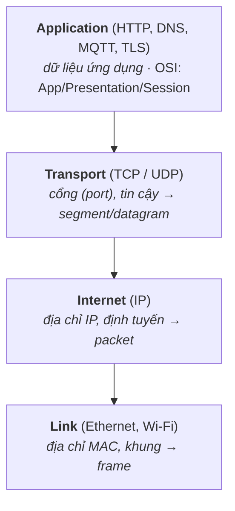
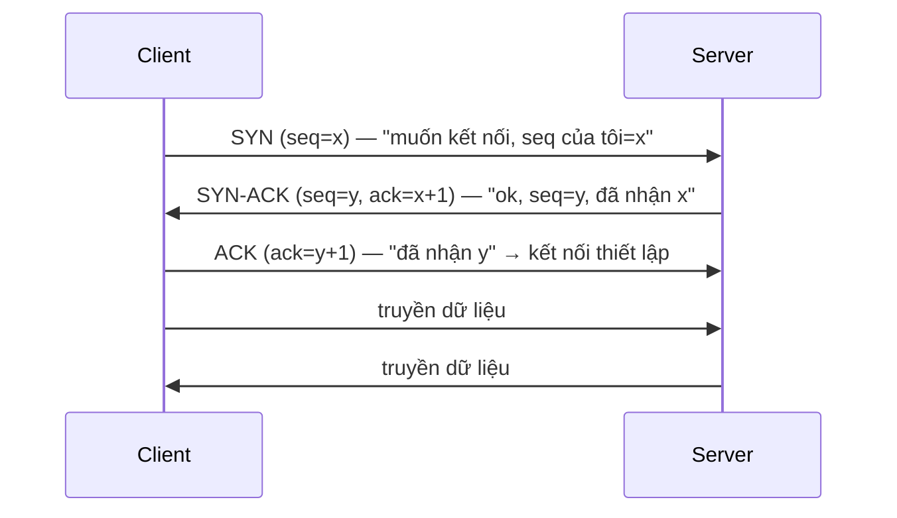

# TCP/IP — Mô hình, IP, TCP vs UDP

> **TL;DR**
> - Mạng tổ chức theo **tầng** (layering): mỗi tầng một trách nhiệm, tầng trên dùng dịch vụ tầng dưới. Mô hình TCP/IP 4 tầng: **Link → Internet (IP) → Transport (TCP/UDP) → Application (HTTP...)**.
> - **IP**: định tuyến gói (packet) giữa các máy qua địa chỉ IP — *best-effort*, không đảm bảo, không thứ tự.
> - **TCP**: tin cậy, có thứ tự, hướng kết nối (three-way handshake), có flow & congestion control. **UDP**: không kết nối, không đảm bảo, nhẹ & nhanh.
> - Chọn: cần tin cậy/đúng thứ tự (web, file) → **TCP**; cần độ trễ thấp, chấp nhận mất gói (video call, game, sensor streaming) → **UDP**.
> - Mỗi tầng đóng gói (encapsulation) thêm header của mình.

---

## 1. Vì sao phân tầng (layering)?

Mạng phức tạp → chia thành các tầng, mỗi tầng giải quyết một việc và che giấu chi tiết khỏi tầng trên. Lợi: thay đổi một tầng (vd đổi Wi-Fi sang Ethernet ở tầng Link) không ảnh hưởng tầng khác; mỗi tầng phát triển độc lập. Đây chính là *separation of concerns* áp dụng cho mạng.


*(Đi xuống mỗi tầng đóng gói thêm header — encapsulation; bên nhận bóc ngược lại.)*

**Encapsulation**: dữ liệu đi xuống, mỗi tầng bọc thêm header của mình (HTTP data → +TCP header → +IP header → +Ethernet header); bên nhận bóc ngược lại.

---

## 2. IP — định tuyến best-effort

Tầng Internet dùng **địa chỉ IP** để định tuyến packet qua nhiều router từ nguồn tới đích.
- **Best-effort**: IP *không* đảm bảo gói tới nơi, tới đúng thứ tự, hay không trùng — chỉ "cố gắng". Độ tin cậy (nếu cần) do tầng trên (TCP) lo.
- **IPv4** (32-bit, vd `192.168.1.1`) cạn địa chỉ → **NAT** và **IPv6** (128-bit).
- Router chuyển tiếp packet dựa trên bảng định tuyến; packet có thể đi đường khác nhau.

---

## 3. TCP vs UDP — hai giao thức transport

| | TCP | UDP |
|--|-----|-----|
| Kết nối | Hướng kết nối (handshake trước) | Không kết nối |
| Tin cậy | Đảm bảo tới, đúng thứ tự, không trùng | Không đảm bảo (có thể mất/lệch thứ tự) |
| Kiểm soát | Flow control + congestion control | Không |
| Tốc độ/overhead | Chậm hơn, header lớn hơn (20+ byte) | Nhanh, nhẹ (header 8 byte) |
| Mô hình | Luồng byte (stream) | Gói rời rạc (datagram) |
| Dùng cho | Web (HTTP), file, email, SSH | Video/voice call, game, DNS, streaming sensor |

**Chọn:** cần dữ liệu **nguyên vẹn, đúng thứ tự** → TCP. Cần **độ trễ thấp**, chấp nhận mất vài gói (mất một frame video không sao, nhưng trễ thì tệ) → UDP. UDP cũng dùng khi tự xây cơ chế tin cậy riêng (QUIC làm vậy trên UDP).

---

## 4. TCP three-way handshake — thiết lập kết nối



Ba bước để **cả hai bên đồng bộ số thứ tự (sequence number)** và xác nhận hai chiều cùng sẵn sàng. Đóng kết nối dùng **four-way** (FIN/ACK mỗi chiều, vì mỗi hướng đóng độc lập). Trạng thái `TIME_WAIT` sau khi đóng đảm bảo gói trễ không lẫn sang kết nối mới.

---

## 5. Cơ chế tin cậy của TCP

TCP biến IP best-effort thành kênh tin cậy nhờ:
- **Sequence number + ACK**: mỗi byte có số thứ tự; bên nhận ACK những gì đã nhận. Không ACK → **retransmit** (gửi lại).
- **Thứ tự**: bên nhận sắp xếp lại theo sequence number trước khi giao cho ứng dụng.
- **Flow control** (cửa sổ nhận — receive window): bên nhận báo còn nhận được bao nhiêu → tránh tràn bộ đệm bên nhận.
- **Congestion control** (slow start, congestion avoidance...): điều tiết tốc độ gửi theo tình trạng tắc nghẽn mạng → tránh làm sập mạng. Đây là lý do throughput TCP thay đổi theo điều kiện mạng.

> Phân biệt: **flow control** bảo vệ *bên nhận* (đừng gửi nhanh hơn nó xử lý); **congestion control** bảo vệ *mạng* (đừng gửi nhanh hơn mạng chịu được).

---

## 6. ⚠️ TCP là LUỒNG BYTE — không có ranh giới message

> **Đây là hệ quả thực dụng quan trọng nhất của cả trang này.** Nó sinh ra một lớp bug kinh điển: **chạy đúng ở phòng lab, sai ở nhà khách**.

### Cái TCP hứa và cái nó KHÔNG hứa

| ✅ TCP hứa | ❌ TCP **không** hứa |
|---|---|
| Byte tới **đủ**, không mất | Bạn `write()` 8 byte một lần thì bên kia `read()` được 8 byte một lần |
| Byte tới **đúng thứ tự** | Một lần `send` = một lần `recv` |
| Không trùng lặp | Có bất kỳ khái niệm "gói tin" nào ở tầng ứng dụng |

TCP là **byte stream**: nó chỉ đảm bảo *dãy byte*, hoàn toàn **không lưu giữ ranh giới các lần ghi**. UDP thì ngược lại — datagram giữ nguyên ranh giới, một `sendto` = một `recvfrom`.

### Hai hiện tượng, cùng một nguyên nhân

```
Bên gửi:  send("ABCDEFGH")        (8 byte, một lần gọi)

① Chia nhỏ (short read):     recv -> "ABC"        recv -> "DEFGH"
② Dính gói (coalescing):     send("XY") ngay sau  ->  recv -> "ABCDEFGHXY"
```

**Vì sao xảy ra:** **MSS/phân mảnh** (dữ liệu vắt qua hai segment) · **Nagle + delayed ACK** (gom nhiều lần ghi nhỏ thành một segment) · **retransmit** làm segment sau tới trễ · và `read()` **trả về ngay khi có byte nào đó**, không đợi đủ số byte bạn xin.

### ⚠️ Vì sao phòng lab không bao giờ lộ

LAN có **RTT ~0.1 ms**, không mất gói ⇒ dữ liệu nhỏ **luôn** gọn trong một segment và **đã nằm sẵn** trong receive buffer trước khi bạn gọi `read()`. Ra hiện trường qua Wi-Fi/4G: RTT vài chục ms, có retransmit và jitter ⇒ cửa sổ *"mới tới một phần"* mở ra thật.

⇒ **"Test không lỗi" không chứng minh code đúng.** Phải suy luận theo cơ chế, không theo kết quả chạy.

### Hệ quả bắt buộc: mọi protocol trên TCP phải TỰ ĐÓNG KHUNG (framing)

| Cách framing | Cách làm | Đánh đổi |
|---|---|---|
| **Length-prefix** ⭐ | Gửi độ dài (vd 4 byte) rồi mới gửi thân | Đơn giản, nhanh, **nên dùng mặc định**. Nhớ thống nhất **endianness** |
| **Delimiter** | Kết thúc bằng ký tự đánh dấu (`\n`) | Đọc log dễ. **Phải giới hạn buffer**, nếu không một gói không có `\n` làm cạn RAM (DoS) — và phải escape ký tự đó trong dữ liệu |
| **Độ dài cố định** | Mọi message đúng N byte | Chỉ hợp giao thức nhị phân cứng; hết co giãn |

```c
// ✅ Mọi read trên socket đều phải có dạng này — KHÔNG BAO GIỜ dùng read() trần
static int read_full(int fd, void* buf, size_t len) {
    size_t got = 0;
    while (got < len) {
        ssize_t n = read(fd, (char*)buf + got, len - got);
        if (n > 0)  { got += n; continue; }
        if (n == 0) return 0;                 // peer đóng sớm
        if (errno == EINTR) continue;         // bị signal cắt, không phải lỗi
        return -1;
    }
    return 1;
}

// ❌ Bug kinh điển — chỉ lộ ở nhà khách
ssize_t n = read(sock, hdr, 8);
if (n != 8) { /* coi là lỗi */ }
```

**Bẫy:** (1) `if (n != count) return -1;` — sai; (2) chỉ lặp cho `read` mà quên **`write` cũng short**; (3) test bằng **file trên đĩa** — file thường luôn trả đủ nên bug không bao giờ lộ, **phải test bằng socket/pipe thật**; (4) tưởng tắt Nagle (`TCP_NODELAY`) là hết dính gói — không, nó chỉ giảm độ trễ, **ranh giới message vẫn không tồn tại**.

> 🔗 Bank: [LNX-005](../14-prep/mock-interview/bank/linux-sysprog.md) (short read), [LNX-028](../14-prep/mock-interview/bank/linux-sysprog.md) (short write). Chi tiết syscall: [04-linux-system-programming/file-io.md](../04-linux-system-programming/file-io.md).

---

## 7. Khái niệm liên quan (điểm danh)

- **Port**: phân biệt nhiều dịch vụ/kết nối trên cùng IP (vd 80=HTTP, 443=HTTPS, 22=SSH). Một kết nối TCP định danh bởi bộ 4: (IP nguồn, port nguồn, IP đích, port đích).
- **DNS**: dịch tên miền → IP (chạy chủ yếu trên UDP).
- **MTU / fragmentation**: kích thước gói tối đa của tầng link; gói lớn bị phân mảnh.
- **NAT**: nhiều thiết bị mạng nội bộ chia sẻ một IP công khai.
- **Embedded**: thiết bị thường dùng lightweight TCP/IP stack (lwIP) thay vì stack đầy đủ của Linux để tiết kiệm tài nguyên.

---

## Câu hỏi phỏng vấn liên quan

> Đáp án sống trong [bank/](../14-prep/mock-interview/bank/) — **một đáp án, một chỗ** ([CLAUDE.md §4.7](../CLAUDE.md)). Tự trả lời trước khi mở.

| ID | Câu hỏi |
|----|---------|
| [NET-002](../14-prep/mock-interview/bank/networking.md) | Vì sao mạng được tổ chức theo tầng (layering)? |
| [NET-001](../14-prep/mock-interview/bank/networking.md) | TCP và UDP khác nhau thế nào? Khi nào chọn cái nào? |
| [NET-004](../14-prep/mock-interview/bank/networking.md) | Mô tả TCP three-way handshake. Vì sao cần ba bước? |
| [NET-005](../14-prep/mock-interview/bank/networking.md) | TCP đảm bảo tin cậy bằng cách nào trên nền IP best-effort? |
| [NET-008](../14-prep/mock-interview/bank/networking.md) | Phân biệt flow control và congestion control trong TCP. |

---
⬅️ [Về index topic](README.md) · ➡️ Tiếp theo: [sockets-and-protocols.md](sockets-and-protocols.md)
