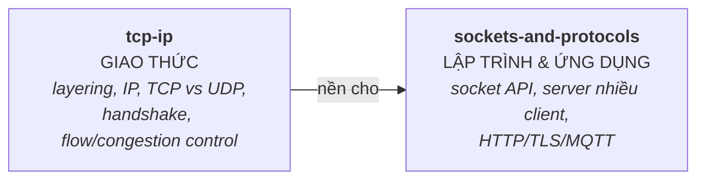

# 14 — Networking

Mạng máy tính cho System/Embedded engineer: mô hình TCP/IP, lập trình socket (mở rộng từ phần socket ở IPC), và các giao thức ứng dụng phổ biến. Phỏng vấn hay hỏi: "TCP vs UDP", "điều gì xảy ra khi gõ URL", "viết server xử lý nhiều client", "three-way handshake".

## 🗺️ Bức tranh tổng thể

> **Sợi chỉ đỏ:** Mạng được tổ chức theo **tầng** (layering). Hai file đi từ *hiểu giao thức* (cái gì chạy bên dưới) tới *lập trình & ứng dụng* (dùng nó thế nào).

- **`tcp-ip` là nền của `sockets`:** chọn `SOCK_STREAM` (TCP) hay `SOCK_DGRAM` (UDP) là hệ quả trực tiếp của hiểu TCP vs UDP; "TCP là luồng byte" giải thích vì sao phải tự framing khi lập trình socket.
- **Layering là cùng tư tưởng "trừu tượng hoá":** mỗi tầng giấu chi tiết tầng dưới — giống virtual memory, "everything is a file", ABI... (xem sợi chỉ đỏ (c) trong [OVERVIEW](../OVERVIEW.md)).
- **Nối xuống Linux:** socket là fd → server nhiều kết nối dùng epoll/event loop của [04/io-multiplexing](../04-linux-system-programming/io-multiplexing.md); Unix domain socket ở [04/ipc-linux](../04-linux-system-programming/ipc-linux.md).
- **Câu hỏi tổng hợp:** *"Điều gì xảy ra khi gõ một URL?"* — xâu chuỗi DNS → TCP handshake (`tcp-ip`) → TLS → HTTP (`sockets-and-protocols`).

## Tài liệu trong topic

| # | File | Nội dung | Trạng thái |
|---|------|----------|-----------|
| 1 | [tcp-ip.md](tcp-ip.md) | mô hình OSI/TCP-IP, IP, TCP vs UDP, handshake, flow/congestion control | ✅ |
| 2 | [sockets-and-protocols.md](sockets-and-protocols.md) | socket API, server/client flow, blocking vs async, HTTP/TLS/MQTT | ✅ |

## Thứ tự đọc gợi ý
`tcp-ip` (nền tảng giao thức) → `sockets-and-protocols` (lập trình & ứng dụng).

## Liên kết
- Socket cơ bản & IPC: [04-linux-system-programming/ipc-linux.md](../04-linux-system-programming/ipc-linux.md)
- I/O multiplexing (server nhiều kết nối): [04-linux-system-programming/io-multiplexing.md](../04-linux-system-programming/io-multiplexing.md)
- Câu hỏi phỏng vấn: [11-interview-questions/networking.md](../11-interview-questions/networking.md)
