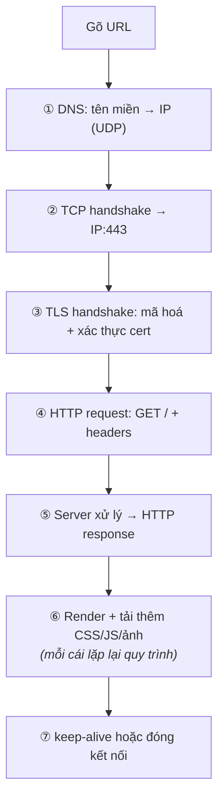

# Socket Programming & Application Protocols

> **TL;DR**
> - **Socket** là endpoint giao tiếp — API thống nhất cho TCP/UDP, local (Unix domain) hay qua mạng.
> - **TCP server flow**: `socket → bind → listen → accept → read/write → close`. **Client**: `socket → connect → read/write → close`.
> - Phục vụ nhiều client: thread-per-connection (đơn giản, tốn) hoặc **event loop + epoll** (scale, xem [io-multiplexing](../04-linux-system-programming/io-multiplexing.md)).
> - **HTTP**: giao thức ứng dụng request/response trên TCP; stateless. **TLS**: lớp mã hóa/xác thực dưới HTTP (→ HTTPS). **MQTT/CoAP**: nhẹ, phổ biến cho IoT/embedded.
> - "Điều gì xảy ra khi gõ URL" là câu kinh điển tổng hợp DNS → TCP → TLS → HTTP.

---

## 1. Socket API — luồng cơ bản

Socket là sự tổng quát hóa file descriptor cho giao tiếp mạng (cùng `read`/`write`/`close`).

```c
// ===== TCP SERVER =====
int s = socket(AF_INET, SOCK_STREAM, 0);   // tạo socket (TCP=SOCK_STREAM)
bind(s, addr, len);                         // gắn vào IP:port
listen(s, backlog);                         // chuyển sang chế độ nghe
int c = accept(s, ...);                     // chờ & nhận một kết nối → fd mới cho client
read(c, buf, n); write(c, resp, m);         // trao đổi dữ liệu
close(c); close(s);

// ===== TCP CLIENT =====
int s = socket(AF_INET, SOCK_STREAM, 0);
connect(s, serverAddr, len);                // chủ động kết nối tới server
write(s, req, n); read(s, buf, m);
close(s);
```

- `AF_INET`/`AF_INET6` = mạng IPv4/IPv6; `AF_UNIX` = cùng máy. `SOCK_STREAM`=TCP, `SOCK_DGRAM`=UDP.
- **UDP** không `listen`/`accept`/`connect` (tùy chọn): dùng `sendto`/`recvfrom` với địa chỉ mỗi gói.
- `accept` trả về **fd mới** cho mỗi client; socket nghe (`s`) tiếp tục nhận kết nối khác.

---

## 2. Phục vụ nhiều client — các mô hình

| Mô hình | Cách làm | Đánh đổi |
|---------|----------|----------|
| **Thread/process per connection** | Mỗi client một thread (hoặc fork) blocking | Đơn giản; tốn RAM/context switch khi nhiều kết nối |
| **Thread pool** | Tập thread cố định nhận việc từ hàng đợi | Giới hạn tài nguyên; phức tạp hơn |
| **Event loop + epoll** | Một (vài) thread + non-blocking I/O + epoll | Scale tới hàng chục nghìn kết nối; "không bao giờ block" |

Mô hình **event loop** là chuẩn cho server hiệu năng cao (Nginx/Redis) — chi tiết ở [io-multiplexing](../04-linux-system-programming/io-multiplexing.md). Nguyên tắc: I/O non-blocking, không chặn loop; tác vụ CPU nặng đẩy sang thread riêng.

---

## 3. Vài vấn đề thực tế khi lập trình socket

- **TCP là luồng byte, không có ranh giới message**: một `read` có thể nhận một phần hoặc nhiều message gộp lại → phải tự **framing** (độ dài prefix, hoặc delimiter). Lỗi phổ biến của người mới.
- **Short read/write**: phải lặp tới khi đủ (như [file-io](../04-linux-system-programming/file-io.md)).
- **`SIGPIPE`**: ghi vào socket đã đóng đầu kia → nên ignore và xử lý `EPIPE`.
- **Byte order**: dùng `htons`/`htonl` chuyển port/IP sang network byte order (big-endian).
- **`SO_REUSEADDR`**: cho phép bind lại nhanh sau khi server restart (tránh "Address already in use" do `TIME_WAIT`).

---

## 4. HTTP — giao thức ứng dụng phổ biến nhất

HTTP là giao thức **request/response** chạy trên TCP, dạng text (HTTP/1.1):
```
GET /api/data HTTP/1.1          ← request line (method, path, version)
Host: example.com               ← headers
Accept: application/json

                                ← dòng trống ngăn header/body
```
```
HTTP/1.1 200 OK                 ← status line (version, code, lý do)
Content-Type: application/json
Content-Length: 27

{"temperature": 25.3}           ← body
```

- **Method**: GET (đọc), POST (tạo), PUT (cập nhật), DELETE (xóa)...
- **Status code**: 2xx thành công, 3xx redirect, 4xx lỗi client, 5xx lỗi server.
- **Stateless**: mỗi request độc lập; trạng thái duy trì qua cookie/token.
- HTTP/2 (nhị phân, multiplexing), HTTP/3 (trên QUIC/UDP) cải thiện hiệu năng.

---

## 5. TLS & các giao thức embedded/IoT

- **TLS** (Transport Layer Security): lớp mã hóa + xác thực giữa TCP và application → HTTP+TLS = **HTTPS**. Cung cấp bảo mật (mã hóa), toàn vẹn (chống sửa), xác thực (certificate). Handshake TLS thiết lập khóa phiên.
- **MQTT**: giao thức **publish/subscribe** nhẹ trên TCP — chuẩn de-facto cho IoT (thiết bị publish dữ liệu lên broker, bên quan tâm subscribe). Tiết kiệm băng thông, hợp thiết bị tài nguyên ít.
- **CoAP**: giống HTTP nhưng trên UDP, rất nhẹ — cho thiết bị cực hạn chế.
- Embedded thường dùng **lwIP** (lightweight TCP/IP stack) + mbedTLS thay vì stack đầy đủ.

---

## 6. "Điều gì xảy ra khi gõ một URL?" (câu tổng hợp kinh điển)

1. **DNS**: phân giải tên miền → địa chỉ IP (truy vấn DNS, chủ yếu UDP).
2. **TCP handshake**: thiết lập kết nối tới IP:443 (three-way handshake).
3. **TLS handshake**: thỏa thuận mã hóa, xác thực certificate, tạo khóa phiên (với HTTPS).
4. **HTTP request**: gửi `GET /` + headers.
5. **Server xử lý** và trả **HTTP response** (HTML/JSON...).
6. **Render**: trình duyệt phân tích, tải thêm tài nguyên (CSS/JS/ảnh — mỗi cái lặp lại quy trình), hiển thị.
7. Đóng/giữ kết nối (keep-alive để tái dùng).



Câu này hay vì nó xâu chuỗi toàn bộ stack: DNS → TCP → TLS → HTTP → ứng dụng — thể hiện hiểu biết hệ thống đầu-cuối.

---

## Câu hỏi phỏng vấn liên quan

<details><summary>1) Mô tả luồng tạo một TCP server bằng socket API.</summary>

Server: `socket()` tạo một socket TCP (`AF_INET`, `SOCK_STREAM`); `bind()` gắn nó vào một địa chỉ IP và port; `listen()` chuyển socket sang chế độ thụ động chờ kết nối (với một backlog hàng đợi); `accept()` chặn tới khi có client kết nối và trả về một **file descriptor mới** dành riêng cho client đó (socket nghe vẫn tiếp tục nhận kết nối khác); rồi dùng `read`/`write` trên fd client để trao đổi dữ liệu; cuối cùng `close` fd client và socket nghe khi xong. Phía client đơn giản hơn: `socket()` rồi `connect()` tới địa chỉ server, sau đó `write`/`read` và `close`. Để phục vụ nhiều client đồng thời, kết hợp accept với thread-per-connection hoặc event loop + epoll.
</details>

<details><summary>2) TCP là luồng byte — điều này gây vấn đề gì khi lập trình? Giải quyết thế nào?</summary>

Vì TCP là luồng byte liên tục **không có ranh giới message**, một lời gọi `read` có thể trả về chỉ một phần của message, hoặc nhiều message gộp lại, hoặc một message rưỡi — không tương ứng một-một với các `write` của bên gửi. Nếu giả định "một read = một message" thì code sẽ lỗi. Giải quyết bằng **framing** ở tầng ứng dụng: thêm tiền tố độ dài (length prefix) trước mỗi message để bên nhận biết đọc bao nhiêu byte, hoặc dùng ký tự phân tách (delimiter) như `\n`, hoặc giao thức tự mô tả độ dài (như HTTP dùng Content-Length). Đồng thời phải xử lý short read (lặp đọc cho tới khi đủ một frame) và buffer phần dư cho lần sau. UDP thì giữ ranh giới datagram nên không có vấn đề này (nhưng không đảm bảo tin cậy).
</details>

<details><summary>3) Làm sao một server xử lý hàng nghìn kết nối đồng thời?</summary>

Không dùng mô hình một thread blocking cho mỗi kết nối vì hàng nghìn thread tốn quá nhiều RAM (mỗi stack vài MB) và context switch. Cách scale là mô hình **event-driven**: đặt socket ở chế độ non-blocking và dùng I/O multiplexing (epoll trên Linux) để một thread theo dõi nhiều fd, chỉ xử lý những fd đã sẵn sàng. Vòng lặp sự kiện gọi `epoll_wait`, rồi với mỗi fd sẵn sàng thì accept kết nối mới hoặc đọc/ghi non-blocking — một thread phục vụ rất nhiều kết nối với ít tài nguyên (kiến trúc của Nginx/Redis). Nguyên tắc cốt lõi: không bao giờ block trong event loop; tác vụ CPU nặng đẩy sang thread pool. Có thể mở rộng thêm bằng nhiều event loop trên nhiều core. (Xem io-multiplexing để biết chi tiết epoll, level vs edge triggered.)
</details>

<details><summary>4) HTTP là gì? "Stateless" nghĩa là gì?</summary>

HTTP là giao thức ứng dụng theo mô hình request/response chạy trên TCP: client gửi request (method như GET/POST, đường dẫn, headers, tùy chọn body), server trả response (status code, headers, body). Status code phân nhóm: 2xx thành công, 3xx redirect, 4xx lỗi phía client, 5xx lỗi phía server. "Stateless" nghĩa là **mỗi request độc lập, server không tự nhớ trạng thái giữa các request** — server không lưu ngữ cảnh từ request trước trong giao thức. Trạng thái (như đăng nhập) được duy trì bằng cơ chế ở tầng trên: cookie, session token, hoặc JWT gửi kèm mỗi request. Tính stateless giúp HTTP đơn giản và dễ scale ngang (request có thể đi tới bất kỳ server nào), đổi lại phải truyền thông tin trạng thái mỗi lần.
</details>

<details><summary>5) TLS cung cấp gì? HTTPS hoạt động thế nào ở mức cao?</summary>

TLS (Transport Layer Security) là lớp bảo mật nằm giữa TCP và giao thức ứng dụng, cung cấp ba đảm bảo: **bảo mật** (mã hóa dữ liệu nên bên nghe lén không đọc được), **toàn vẹn** (phát hiện dữ liệu bị sửa đổi), và **xác thực** (xác minh danh tính server qua certificate, tùy chọn cả client). HTTPS chính là HTTP chạy trên TLS. Ở mức cao: sau khi thiết lập TCP, hai bên thực hiện TLS handshake — server gửi certificate (được CA ký) để client xác thực danh tính, hai bên thỏa thuận thuật toán và trao đổi khóa để tạo ra một **khóa phiên đối xứng**; sau đó toàn bộ dữ liệu HTTP được mã hóa bằng khóa phiên này. Nhờ vậy dữ liệu nhạy cảm (mật khẩu, thông tin cá nhân) được bảo vệ trên đường truyền. Trong embedded thường dùng thư viện nhẹ như mbedTLS.
</details>

<details><summary>6) Giao thức nào phù hợp cho thiết bị IoT/embedded và vì sao?</summary>

MQTT là lựa chọn phổ biến nhất: giao thức publish/subscribe nhẹ trên TCP, trong đó thiết bị publish dữ liệu lên một broker và các bên quan tâm subscribe theo topic. Nó tiết kiệm băng thông (header nhỏ), hỗ trợ kết nối không ổn định (QoS levels, last-will message), và tách rời bên gửi/nhận — rất hợp thiết bị tài nguyên ít và mạng chập chờn. CoAP là một lựa chọn khác, giống HTTP về mô hình request/response nhưng chạy trên UDP và cực nhẹ, cho thiết bị hạn chế hơn nữa. Lý do chung: các giao thức web đầy đủ (HTTP/1.1 text, TCP stack đầy đủ) quá nặng về băng thông và bộ nhớ cho nhiều thiết bị nhúng; các giao thức IoT được thiết kế tối giản để vừa tài nguyên hạn chế, tiết kiệm điện và chịu được mạng không ổn định. Embedded cũng thường dùng stack nhẹ như lwIP + mbedTLS thay vì stack đầy đủ.
</details>

---
⬅️ [tcp-ip.md](tcp-ip.md) · ➡️ Về [README chính](../README.md)
