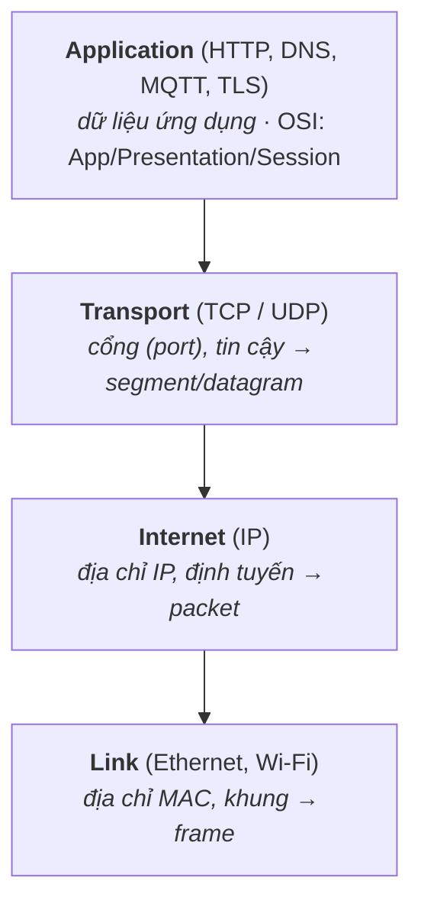
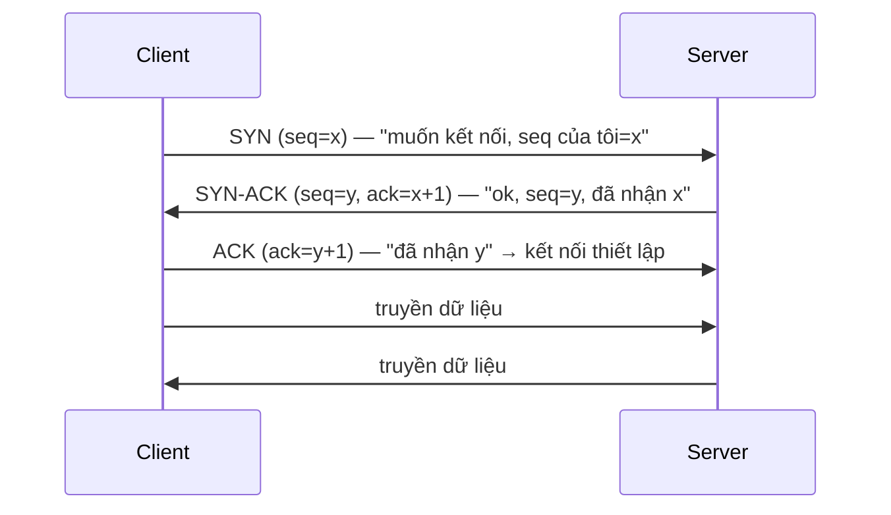

# TCP/IP — Mô hình, IP, TCP vs UDP

> **TL;DR**
> - Mạng tổ chức theo **tầng** (layering): mỗi tầng một trách nhiệm, tầng trên dùng dịch vụ tầng dưới. Mô hình TCP/IP 4 tầng: **Link → Internet (IP) → Transport (TCP/UDP) → Application (HTTP...)**.
> - **IP**: định tuyến gói (packet) giữa các máy qua địa chỉ IP — *best-effort*, không đảm bảo, không thứ tự.
> - **TCP**: tin cậy, có thứ tự, hướng kết nối (three-way handshake), có flow & congestion control. **UDP**: không kết nối, không đảm bảo, nhẹ & nhanh.
> - Chọn: cần tin cậy/đúng thứ tự (web, file) → **TCP**; cần độ trễ thấp, chấp nhận mất gói (video call, game, sensor streaming) → **UDP**.
> - Mỗi tầng đóng gói (encapsulation) thêm header của mình.

---

## 1. Vì sao phân tầng (layering)?

Mạng phức tạp → chia thành các tầng, mỗi tầng giải quyết một việc và che giấu chi tiết khỏi tầng trên. Lợi: thay đổi một tầng (vd đổi Wi-Fi sang Ethernet ở tầng Link) không ảnh hưởng tầng khác; mỗi tầng phát triển độc lập. Đây chính là *separation of concerns* áp dụng cho mạng.

*(Đi xuống mỗi tầng đóng gói thêm header — encapsulation; bên nhận bóc ngược lại.)*

**Encapsulation**: dữ liệu đi xuống, mỗi tầng bọc thêm header của mình (HTTP data → +TCP header → +IP header → +Ethernet header); bên nhận bóc ngược lại.

---

## 2. IP — định tuyến best-effort

Tầng Internet dùng **địa chỉ IP** để định tuyến packet qua nhiều router từ nguồn tới đích.
- **Best-effort**: IP *không* đảm bảo gói tới nơi, tới đúng thứ tự, hay không trùng — chỉ "cố gắng". Độ tin cậy (nếu cần) do tầng trên (TCP) lo.
- **IPv4** (32-bit, vd `192.168.1.1`) cạn địa chỉ → **NAT** và **IPv6** (128-bit).
- Router chuyển tiếp packet dựa trên bảng định tuyến; packet có thể đi đường khác nhau.

---

## 3. TCP vs UDP — hai giao thức transport

| | TCP | UDP |
|--|-----|-----|
| Kết nối | Hướng kết nối (handshake trước) | Không kết nối |
| Tin cậy | Đảm bảo tới, đúng thứ tự, không trùng | Không đảm bảo (có thể mất/lệch thứ tự) |
| Kiểm soát | Flow control + congestion control | Không |
| Tốc độ/overhead | Chậm hơn, header lớn hơn (20+ byte) | Nhanh, nhẹ (header 8 byte) |
| Mô hình | Luồng byte (stream) | Gói rời rạc (datagram) |
| Dùng cho | Web (HTTP), file, email, SSH | Video/voice call, game, DNS, streaming sensor |

**Chọn:** cần dữ liệu **nguyên vẹn, đúng thứ tự** → TCP. Cần **độ trễ thấp**, chấp nhận mất vài gói (mất một frame video không sao, nhưng trễ thì tệ) → UDP. UDP cũng dùng khi tự xây cơ chế tin cậy riêng (QUIC làm vậy trên UDP).

---

## 4. TCP three-way handshake — thiết lập kết nối

Ba bước để **cả hai bên đồng bộ số thứ tự (sequence number)** và xác nhận hai chiều cùng sẵn sàng. Đóng kết nối dùng **four-way** (FIN/ACK mỗi chiều, vì mỗi hướng đóng độc lập). Trạng thái `TIME_WAIT` sau khi đóng đảm bảo gói trễ không lẫn sang kết nối mới.

---

## 5. Cơ chế tin cậy của TCP

TCP biến IP best-effort thành kênh tin cậy nhờ:
- **Sequence number + ACK**: mỗi byte có số thứ tự; bên nhận ACK những gì đã nhận. Không ACK → **retransmit** (gửi lại).
- **Thứ tự**: bên nhận sắp xếp lại theo sequence number trước khi giao cho ứng dụng.
- **Flow control** (cửa sổ nhận — receive window): bên nhận báo còn nhận được bao nhiêu → tránh tràn bộ đệm bên nhận.
- **Congestion control** (slow start, congestion avoidance...): điều tiết tốc độ gửi theo tình trạng tắc nghẽn mạng → tránh làm sập mạng. Đây là lý do throughput TCP thay đổi theo điều kiện mạng.

> Phân biệt: **flow control** bảo vệ *bên nhận* (đừng gửi nhanh hơn nó xử lý); **congestion control** bảo vệ *mạng* (đừng gửi nhanh hơn mạng chịu được).

---

## 6. Khái niệm liên quan (điểm danh)

- **Port**: phân biệt nhiều dịch vụ/kết nối trên cùng IP (vd 80=HTTP, 443=HTTPS, 22=SSH). Một kết nối TCP định danh bởi bộ 4: (IP nguồn, port nguồn, IP đích, port đích).
- **DNS**: dịch tên miền → IP (chạy chủ yếu trên UDP).
- **MTU / fragmentation**: kích thước gói tối đa của tầng link; gói lớn bị phân mảnh.
- **NAT**: nhiều thiết bị mạng nội bộ chia sẻ một IP công khai.
- **Embedded**: thiết bị thường dùng lightweight TCP/IP stack (lwIP) thay vì stack đầy đủ của Linux để tiết kiệm tài nguyên.

---

## Câu hỏi phỏng vấn liên quan

1) Vì sao mạng được tổ chức theo tầng (layering)?

Vì mạng quá phức tạp để xử lý một khối; chia thành các tầng cho phép mỗi tầng giải quyết một trách nhiệm rõ ràng và che giấu chi tiết khỏi tầng trên, theo nguyên lý separation of concerns. Mô hình TCP/IP gồm Link (truyền khung trên môi trường vật lý), Internet/IP (định tuyến packet giữa các máy qua địa chỉ IP), Transport (TCP/UDP — giao tiếp giữa các tiến trình qua port, tin cậy hay không), và Application (HTTP, DNS...). Lợi ích: có thể thay đổi hoặc nâng cấp một tầng mà không ảnh hưởng tầng khác (đổi Wi-Fi sang Ethernet không đụng tới TCP/HTTP), mỗi tầng phát triển độc lập, và dễ chuẩn hóa. Dữ liệu đi xuống được mỗi tầng đóng gói thêm header (encapsulation) và bên nhận bóc ngược lại.

2) TCP và UDP khác nhau thế nào? Khi nào chọn cái nào?

TCP hướng kết nối (thiết lập qua three-way handshake trước khi truyền), đảm bảo dữ liệu tới nơi, đúng thứ tự, không trùng (qua sequence number, ACK, retransmit), và có flow control + congestion control; nó là luồng byte, nhưng overhead lớn hơn và chậm hơn. UDP không kết nối, không đảm bảo (gói có thể mất, lệch thứ tự, trùng), không kiểm soát luồng/tắc nghẽn; nó truyền datagram rời rạc, nhẹ và nhanh, độ trễ thấp. Chọn TCP khi cần dữ liệu nguyên vẹn và đúng thứ tự (web/HTTP, truyền file, email, SSH). Chọn UDP khi ưu tiên độ trễ thấp và chấp nhận mất mát (gọi video/voice, game thời gian thực, DNS, streaming dữ liệu sensor) — nơi một gói trễ tệ hơn một gói mất; hoặc khi tự xây cơ chế tin cậy riêng (như QUIC trên UDP).

3) Mô tả TCP three-way handshake. Vì sao cần ba bước?

Handshake gồm: client gửi SYN với sequence number khởi đầu x ("tôi muốn kết nối, seq của tôi là x"); server đáp SYN-ACK với seq y của nó và ack = x+1 ("đồng ý, seq của tôi là y, đã nhận x"); client gửi ACK với ack = y+1 ("đã nhận y") và kết nối thiết lập. Cần ba bước để **cả hai bên trao đổi và xác nhận sequence number khởi đầu của nhau** theo cả hai chiều, đảm bảo cả hai cùng sẵn sàng và đồng bộ trước khi truyền dữ liệu (TCP đánh số từng byte để đảm bảo thứ tự/tin cậy nên cần seq ban đầu của mỗi hướng). Hai bước là không đủ vì chiều server→client chưa được client xác nhận. Đóng kết nối dùng four-way handshake (FIN/ACK mỗi chiều) vì mỗi hướng đóng độc lập.

4) TCP đảm bảo tin cậy bằng cách nào trên nền IP best-effort?

IP chỉ best-effort (không đảm bảo gói tới, đúng thứ tự hay không trùng), nên TCP tự xây độ tin cậy ở tầng transport: mỗi byte có **sequence number**, bên nhận gửi **ACK** cho dữ liệu đã nhận; nếu bên gửi không nhận ACK trong thời gian chờ thì **retransmit**. Bên nhận dùng sequence number để **sắp xếp lại** các segment đúng thứ tự và loại trùng trước khi giao cho ứng dụng. Ngoài ra TCP có **flow control** qua cửa sổ nhận (receive window) để không gửi nhanh hơn bên nhận xử lý, và **congestion control** (slow start, congestion avoidance) để điều tiết tốc độ theo tình trạng tắc nghẽn mạng. Kết hợp lại biến kênh IP không tin cậy thành luồng byte tin cậy, đúng thứ tự.

5) Phân biệt flow control và congestion control trong TCP.

Cả hai đều điều tiết tốc độ gửi nhưng bảo vệ đối tượng khác nhau. Flow control bảo vệ **bên nhận**: bên nhận thông báo kích thước cửa sổ nhận (còn bao nhiêu chỗ trong bộ đệm) để bên gửi không gửi nhanh hơn bên nhận có thể tiếp nhận và xử lý, tránh tràn bộ đệm bên nhận. Congestion control bảo vệ **mạng**: bằng các thuật toán như slow start và congestion avoidance, TCP dò và điều chỉnh tốc độ gửi theo mức độ tắc nghẽn của mạng (suy ra từ mất gói/độ trễ), tránh bơm quá nhiều dữ liệu làm nghẽn router và sụp đổ thông lượng chung. Nói gọn: flow control là thỏa thuận giữa hai đầu cuối về khả năng của bên nhận; congestion control là phản ứng với tình trạng của mạng ở giữa.

---
⬅️ [Về index topic](README.md) · ➡️ Tiếp theo: [sockets-and-protocols.md](sockets-and-protocols.md)
