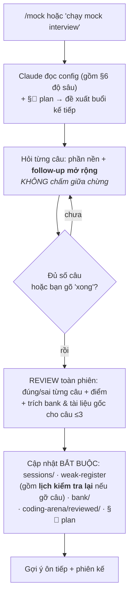

# 🎤 Mock Interview — Phỏng vấn thử tương tác

> Lớp **điều phối phỏng vấn**: biến toàn bộ kiến thức của repo thành **phiên phỏng vấn thử chạy được** — Claude đóng vai interviewer, bạn đóng vai ứng viên. Song song là **ngân hàng câu hỏi duy nhất** để tự ôn. Đây không phải nội dung kiến thức mới; mọi câu đều link về tài liệu nguồn.
> Quan hệ với [study-plans/](../study-plans/): study-plans cho bạn *lịch đọc*; mock-interview cho bạn *bài kiểm tra dạng phỏng vấn*. Dùng xen kẽ.

---

## 🚀 Bắt đầu nhanh (2 cách — cùng đọc [config.md](config.md))

**Cách 1 — Slash command (gọn nhất):** trong một hội thoại mới, gõ
```
/mock
```
Claude đọc config, rồi mở **§📍 Tiến độ** của [datalogic-plan](../study-plans/datalogic-plan.md) và **đề xuất thẳng buổi kế tiếp** (track + type + lệnh chính xác đã ghi sẵn ở đó). Chỉ khi plan đã chạy hết — hoặc bạn nói rõ là ôn tự do — Claude mới hỏi bạn chọn track/type.

**Cách 2 — Thủ công:** trong hội thoại mới, nói
> "Chạy mock interview" (kèm track/type nếu muốn, vd "mock comprehensive track BSP").

Cả hai đều nạp [config.md](config.md) làm hợp đồng vận hành — **bao gồm [§6 Hợp đồng ĐỘ SÂU](config.md)**, phần quyết định phiên có sâu hay không.

---

## 🧭 Chọn gì cho một phiên?

Một phiên = **1 track** (hỏi về mảng nào) × **1 interview type** (hình thức phỏng vấn).

### Track — hỏi về mảng nào (chi tiết: [tracks.md](tracks.md))
- **Theo công việc:** `bsp` (Embedded Linux/BSP) · `cpp-system` (C++ System SW).
- **Theo phần:** `modern-cpp` · `os` · `linux-sysprog` · `embedded` (bare-metal/MCU/RTOS/firmware) · `drivers-dt` · `debugging` · `dsa` · `design-patterns` · `networking` · `system-design` · `behavioral`.
- **Theo sách đã summary:** `emc` · `cpp-concurrency` · `melp` · `ostep` · `lkd` · `cpp-mindset`.

### Interview type — hình thức (chi tiết: [interview-types.md](interview-types.md))
- `daily` — ôn hằng ngày, 6 câu đa dạng (mặc định).
- `rapid` — 12 câu phản xạ nhanh.
- `comprehensive` — giả lập vòng technical thật, 16 câu đủ độ khó + coding + tình huống.
- `by-level` — luyện đúng 1 mức khó.
- `coding` — làm bài code (viết vào [coding-arena/](coding-arena/)).
- `deep-dive` — 5 câu khó/tình huống 1 mảng.
- `weak-review` — hỏi lại các câu bạn còn yếu.
- `retention` — hỏi lại các câu **đã trả lời tốt** để kiểm tra độ nhớ theo thời gian.
- `full-review` — kiểm tra **toàn diện**: trộn mọi câu đã từng hỏi (yếu + tốt).

---

## 🔁 Cách một phiên diễn ra



**Nguyên tắc quan trọng:**
- **⚠️ Độ sâu là hợp đồng, không phải tuỳ hứng** — [config §6](config.md): **mọi** câu (mới / weak / retention) đều có **phần nền + phần follow-up mở rộng**; nguồn câu chỉ đổi *trọng số* giữa hai phần. Câu weak: nén nền còn 1 checkpoint, **điểm gần như hoàn toàn từ follow-up**. Đây là thứ phân biệt phiên chất lượng với phiên nông.
- **Review chỉ ở cuối phiên** — trong lúc hỏi, interviewer mở rộng/đào sâu như thật; chỉ khi *hoàn thành* mới nhận xét.
- **Câu cũ vẫn được hỏi lại** — không có luật "đúng rồi thôi". Câu từng sai → [weak-register](weak-register.md); câu đã gỡ → bảng **🔁 Lịch kiểm tra lại** (hạn = tuần gỡ + 2), **không câu nào biến mất vĩnh viễn**.
- **Không lặp lại nguyên văn góc hỏi cũ** — hỏi y hệt là đo trí nhớ về hội thoại, không đo kiến thức.
- **Bank là nguồn duy nhất** — câu interviewer tự phát mà chưa có trong bank sẽ được **thêm vào bank** sau phiên.

---

## 🗂️ Cấu trúc module

| Đường dẫn | Vai trò |
|---|---|
| [config.md](config.md) | **Hợp đồng vận hành** — defaults, giao thức phiên, thang chấm, **§6 hợp đồng độ sâu**. Nguồn chân lý. |
| [tracks.md](tracks.md) | Định nghĩa track (job / phần / sách) → ánh xạ tới domain trong bank |
| [interview-types.md](interview-types.md) | Định nghĩa loại phiên → số câu + cơ cấu level |
| [bank/](bank/) | **Ngân hàng câu hỏi DUY NHẤT** (ID xuyên suốt). Xem [bank/README.md](bank/README.md) |
| [sessions/](sessions/) | Log từng phiên (git-track), **tự chứa** — [mẫu](sessions/README.md) |
| [weak-register.md](weak-register.md) | Sổ câu yếu **+ bảng 🔁 Lịch kiểm tra lại** (câu đã gỡ, có hạn hỏi lại) |
| [coding-arena/](coding-arena/) | Nháp code khi làm bài (**git-ignore**) — để lần sau còn làm lại từ file trống |
| [coding-arena/reviewed/](coding-arena/reviewed/) | Bản đã review: bản nộp nguyên trạng + chú thích + bản sửa (**git-track**, phải compile & chạy) |

---

## 🔗 Nguồn câu hỏi

Toàn bộ câu hỏi sống ở **[bank/](bank/)**, không có nơi thứ hai. Các bộ cũ (`11-interview-questions/`, `14-prep/technical_round/02,03,04`) đã gộp hết về đây và **đã xoá** (2026-08-09) sau khi chỉ còn là con trỏ rỗng.

Không tự học từ nhiều nơi — mọi câu ở một chỗ, mọi nơi khác chỉ link tới.
