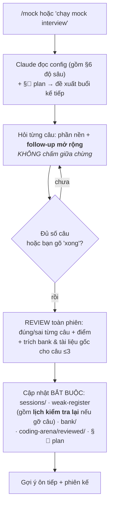

# 🎤 Mock Interview — Phỏng vấn thử tương tác

> Lớp **điều phối phỏng vấn**: biến toàn bộ kiến thức của repo thành **phiên phỏng vấn thử chạy được** — Claude đóng vai interviewer, bạn đóng vai ứng viên. Song song là **ngân hàng câu hỏi duy nhất** để tự ôn. Đây không phải nội dung kiến thức mới; mọi câu đều link về tài liệu nguồn.
> Quan hệ với [study-plans/](../study-plans/): study-plans cho bạn *lịch đọc*; mock-interview cho bạn *bài kiểm tra dạng phỏng vấn*. Dùng xen kẽ.

---

## 🚀 Bắt đầu nhanh (2 cách — cùng đọc [config.md](config.md))

**Cách 1 — Slash command (gọn nhất):** trong một hội thoại mới, gõ
```
/mock
```
Claude đọc config, rồi mở **§📍 Tiến độ** của [datalogic-plan](../study-plans/datalogic-plan.md) và **đề xuất thẳng buổi kế tiếp** (track + type + lệnh chính xác đã ghi sẵn ở đó). Chỉ khi plan đã chạy hết — hoặc bạn nói rõ là ôn tự do — Claude mới hỏi bạn chọn track/type.

**Cách 2 — Thủ công:** trong hội thoại mới, nói
> "Chạy mock interview" (kèm track/type nếu muốn, vd "mock comprehensive track BSP").

Cả hai đều nạp [config.md](config.md) làm hợp đồng vận hành — **bao gồm [§6 Hợp đồng ĐỘ SÂU](config.md)**, phần quyết định phiên có sâu hay không.

---

## 🧭 Chọn gì cho một phiên?

Một phiên = **1 track** (hỏi mảng nào) × **1 interview type** (hình thức). Danh sách đầy đủ **chỉ sống ở hai file chủ** — không liệt kê lại ở đây:

| Chọn | File chủ | Hay dùng nhất |
|---|---|---|
| **Track** | [tracks.md](tracks.md) | `bsp` ⭐(mặc định) · `cpp-system` · `drivers-dt` · `linux-sysprog` · `debugging` · **`resume`** ⭐ |
| **Type** | [interview-types.md](interview-types.md) | `rapid` (12 câu, phản xạ) · `daily` (6 câu, mặc định) · `comprehensive` (16 câu, giả lập vòng thật) |

> 🧪 **Không phải phiên mock: câu `lab`.** Bank còn một loại câu **NGỒI MÁY LÀM** — code có bug thật + nhiệm vụ + **output thật đã chạy** để đối chiếu ([DBG-030…036](bank/debugging.md)). Tự làm ngoài phiên, **không chấm điểm**; phiên mock hỏi câu `concept` tương ứng. Sinh ra vì đo được **T1 3.67 / T2 2.1** — *biết* công cụ nhưng *chưa dùng* công cụ.

---

## 🔁 Cách một phiên diễn ra



**Luật vận hành sống ở [config.md](config.md), không chép lại ở đây.** Bốn thứ quyết định chất lượng một phiên, đọc trước khi chạy:

| Ở đâu | Luật | Chặn lỗi gì |
|---|---|---|
| [§⚖️](config.md) | Thứ tự ưu tiên khi hai file mâu thuẫn | interviewer tự chọn khi config nói ngược nhau |
| [§6](config.md) | Hợp đồng độ sâu — T1/T2/T3, trần mặc định **T2** | phiên **nông** *và* phiên **lệch tầng** (hai lỗi ngược nhau) |
| [§7](config.md) | Đo độ phủ bank mỗi 5 phiên | đào sâu một góc, bỏ trắng phần còn lại |
| [§1 Bước 4](config.md) | Cập nhật bắt buộc sau phiên | phiên chạy xong rồi bay hơi |

Hai nguyên tắc không nằm trong config vì chúng là *tinh thần* chứ không phải thủ tục: **review chỉ ở cuối phiên** (trong lúc hỏi thì đào sâu như thật), và **không câu nào biến mất vĩnh viễn** — không có luật "đúng rồi thôi".

---

## 🗂️ Cấu trúc module

| Đường dẫn | Vai trò |
|---|---|
| [config.md](config.md) | **Hợp đồng vận hành** — defaults, giao thức phiên, thang chấm, **§6 hợp đồng độ sâu**. Nguồn chân lý. |
| [tracks.md](tracks.md) | Định nghĩa track (job / phần / sách) → ánh xạ tới domain trong bank |
| [interview-types.md](interview-types.md) | Định nghĩa loại phiên → số câu + cơ cấu level |
| [bank/](bank/) | **Ngân hàng câu hỏi DUY NHẤT** (ID xuyên suốt). Xem [bank/README.md](bank/README.md) |
| [sessions/](sessions/) | Log từng phiên (git-track), **tự chứa** — [mẫu](sessions/README.md) |
| [weak-register.md](weak-register.md) | Sổ câu yếu **+ bảng 🔁 Lịch kiểm tra lại** (câu đã gỡ, có hạn hỏi lại) |
| [coding-arena/](coding-arena/) | Nháp code khi làm bài (**git-ignore**) — để lần sau còn làm lại từ file trống |
| [coding-arena/reviewed/](coding-arena/reviewed/) | Bản đã review: bản nộp nguyên trạng + chú thích + bản sửa (**git-track**, phải compile & chạy) |

---

## 🔗 Nguồn câu hỏi

Toàn bộ câu hỏi sống ở **[bank/](bank/)**, không có nơi thứ hai. Các bộ cũ (`11-interview-questions/`, `14-prep/technical_round/02,03,04`) đã gộp hết về đây và **đã xoá** (2026-08-09) sau khi chỉ còn là con trỏ rỗng.

Không tự học từ nhiều nơi — mọi câu ở một chỗ, mọi nơi khác chỉ link tới.
