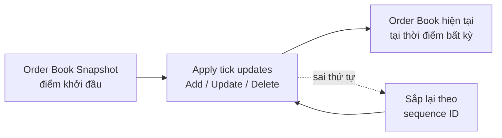

# 🟢 FILE 5 — CHUẨN BỊ PHỎNG VẤN · WORLDQUANT
### Vị trí: **C++ Engineer** (Tick Data Processing Platform) · Hanoi / HCMC

> **Khác biệt quan trọng so với Axon:** Đây KHÔNG phải vai trò embedded. JD đòi hỏi **C++ hiện đại sâu (C++11→23)** + xử lý **tick data / order book** + tư duy hệ thống hiệu năng cao. File này gồm: (A) Hiểu công ty & vai trò, (B) **Kiến thức domain finance bạn CHƯA có** (phải đọc kỹ), (C) Câu hỏi–trả lời — gồm **C.0 vòng HR/recruiter**, C.1 behavioral/động cơ, C.2 kỹ thuật C++, C.3 domain, C.4 hỏi ngược.
>
> 🔎 **Lưu ý về vòng HR của WorldQuant:** Vòng recruiter đầu thường ngắn (~20–30 phút), tập trung: xác minh thông tin CV, động cơ, kỳ vọng lương, thời gian, và một chút "intellectual fit". Có thể có **bài test online (đánh giá năng lực/logic/coding)** trong quy trình tuyển của WorldQuant — hỏi recruiter về các bước tiếp theo. Câu trả lời dưới đây để tiếng Anh kèm ý tiếng Việt, dùng được cho cả phỏng vấn tiếng Anh lẫn tiếng Việt.
>
> ⚠️ **Thành thật về gap:** nền của bạn là embedded/system C++, không phải finance. Điều đó OK — WorldQuant tuyển "intellectual horsepower", không đòi kinh nghiệm tài chính. Chiến lược: **khoe nền C++/system mạnh + thể hiện đã chủ động học domain + ham học**. File này giúp bạn nói chuyện tick data/order book một cách thông minh.

---

## A. HIỂU WORLDQUANT & VAI TRÒ

**Là ai:** Công ty quản lý tài sản định lượng (quantitative asset management) toàn cầu, thành lập 2007 bởi **Igor Tulchinsky**, hơn 850 nhân viên ở ~13 quốc gia (có văn phòng tại Việt Nam).

**Họ làm gì:** Tạo ra các **"alpha"** — *mô hình toán học dự đoán biến động giá tương lai* của các công cụ tài chính — qua nền tảng nghiên cứu độc quyền, để xây chiến lược đầu tư định lượng dựa trên sự kém hiệu quả của thị trường. Ba nhóm phối hợp: **Technologists** (xây platform/tooling — vai trò của bạn), **Researchers** (tìm alpha), **Portfolio Managers**.

**Văn hoá (để map vào câu trả lời):**
- "Academic sensibility paired with accountability for results" — tư duy học thuật + chịu trách nhiệm kết quả.
- "Excellent ideas come from anyone, anywhere" — ý tưởng hay đến từ bất kỳ ai.
- "Think in code", "continuous improvement", "challenge conventional thinking", "no roadmap to future success".
- Môi trường "relaxed yet intellectually driven", không micromanagement.

### Vai trò cụ thể (đọc kỹ JD — đây là điều bạn sẽ làm)
1. **Maintain/enhance platform xử lý tick data C++ legacy**, và giúp **migrate dataset sang platform mới**.
2. **Đóng góp cho platform tick-data C++ hiện đại mới**: hỗ trợ thêm các nguồn tick data đa lớp tài sản (asset classes), phát triển/review các **interval features/statistics dựa trên tick data**, thêm tính năng — giữ chuẩn chất lượng phần mềm cao.
3. **Cộng tác với Research & Portfolio Management** để chuyển từ platform cũ sang mới, phục vụ nhu cầu dữ liệu price-volume cho việc tạo signal.

### JD yêu cầu (tự đánh giá mình ở đâu)
| Yêu cầu | Bạn |
|---------|-----|
| C++ thành thạo qua nhiều version (11/14/17/20/23) | ✅ Mạnh — Modern C++ là thế mạnh, ôn thêm C++20/23 |
| CMake | ✅ Có trong CV |
| Scripting: Perl, Python | ⚠️ Python ✅ (chip porting tool); Perl có thể chưa — nói thật + sẵn sàng học |
| Tick data & order book processing | ❌ Chưa có — **học phần B bên dưới** |
| SDLC, CI/CD, Git, JIRA | ✅ Git, Jira có trong CV; nói thêm về quy trình |
| Attention to detail, patience, agreeable | ✅ Thể hiện qua cross-layer debugging tỉ mỉ |
| English + làm việc đa múi giờ | ✅ Kinh nghiệm làm với HQ Hàn Quốc |

---

## B. KIẾN THỨC DOMAIN — TICK DATA & ORDER BOOK (BẠN PHẢI ĐỌC KỸ) 🔥

> Đây là phần bạn yếu nhất nhưng JD nhấn mạnh nhất. Nắm được mức này là đủ nói chuyện thông minh trong phỏng vấn vòng đầu.

### B.1. Tick data là gì?
**Bản chất:** Dữ liệu thị trường ở mức **chi tiết nhất** — mỗi "tick" là một **thay đổi trên thị trường**: một lệnh mới, một lệnh bị huỷ, hoặc một giao dịch khớp. Mỗi tick gắn **timestamp** (thường tới nano/microsecond) và/hoặc **sequence ID**. Khối lượng cực lớn — hàng triệu tick/giây vào giờ cao điểm.

**3 cấp độ dữ liệu (PHẢI phân biệt):**
- **Level 1 (L1):** chỉ **best bid / best ask** (giá mua/bán tốt nhất) + khối lượng — còn gọi là "quote data".
- **Level 2 (L2):** bid/ask ở **nhiều mức giá** (depth) — thấy được độ sâu thị trường.
- **Level 3 (L3) / MBO (Market By Order):** **từng lệnh riêng lẻ** ở mọi mức giá, kèm vị trí trong hàng đợi (queue position) — chi tiết nhất.

### B.2. Order Book (sổ lệnh) là gì?
**Bản chất:** Danh sách tất cả lệnh **mua (bid)** và **bán (ask/offer)** đang chờ cho một tài sản, sắp theo mức giá. Order book được **dựng nên từ các tick**.

```
            ORDER BOOK (ví dụ)
   ASKS (lệnh bán)          |  giá tăng dần lên trên
   ───────────────────────  |
   $100.05   500 cổ          |
   $100.03   800 cổ          |  ← best ask (giá bán thấp nhất)
   ─────── SPREAD ────────   |  spread = best ask - best bid
   $100.00   600 cổ          |  ← best bid (giá mua cao nhất)
   $99.98    1200 cổ         |
   BIDS (lệnh mua)           |  giá giảm dần xuống dưới
```

**Khái niệm cốt lõi cần thuộc:**
- **Bid:** giá người mua sẵn sàng trả. **Ask/Offer:** giá người bán sẵn sàng nhận.
- **Best bid / best ask:** giá mua cao nhất / giá bán thấp nhất hiện có.
- **Spread:** chênh lệch best ask − best bid (thanh khoản càng cao spread càng hẹp).
- **Depth:** tổng khối lượng ở các mức giá — đo độ "dày" của thị trường.
- **Order imbalance:** mất cân đối khối lượng mua vs bán — tín hiệu hay dùng cho alpha.

### B.3. Cách dựng & duy trì Order Book từ tick (rất hay được hỏi về kỹ thuật)
**Bản chất:** Không truyền lại toàn bộ book mỗi lần. Thay vào đó:
1. Bắt đầu từ một **snapshot** (ảnh chụp toàn bộ book tại một thời điểm).
2. Áp dụng dòng **tick updates** với 3 hành động: **Add (thêm lệnh)**, **Update/Modify (sửa)**, **Delete/Cancel (huỷ)**.
3. Phải xử lý **đúng thứ tự** theo sequence ID/timestamp — nếu tick tới **sai thứ tự (out-of-order)** phải sắp xếp lại theo sequence number, nếu không book sẽ sai.



**Điểm phỏng vấn:** "event-driven state update" — mỗi event cập nhật tăng dần (incremental) trạng thái cache nội bộ; nhận order → ghi giá/khối lượng vào mức giá tương ứng; nhận trade/cancel → trừ khối lượng đã khớp. Duy trì liên tục để có view real-time.

### B.4. Vì sao đây là bài toán C++ khó (kết nối với thế mạnh của bạn)
- **Khối lượng + tốc độ khổng lồ** → cần cấu trúc dữ liệu hiệu quả, cache-friendly, **tránh cấp phát động trong hot path** (đúng tư duy embedded của bạn!).
- **Low latency** → quan tâm tới layout bộ nhớ, tránh copy thừa (move semantics, string_view), lock contention.
- **Cấu trúc dữ liệu cho order book:** thường dùng map theo mức giá (sorted), hoặc mảng/hash cho truy cập O(1) tới mức giá; cân nhắc giữa tốc độ chèn/xoá và tra cứu best bid/ask.
- **Interval features/statistics:** tính các thống kê trên cửa sổ thời gian (vd VWAP, volume, high/low trong khoảng) → liên hệ **sliding window** + **ring buffer** bạn đã học.

> 🔗 **Cầu nối vàng:** kinh nghiệm embedded của bạn (bounded memory, không malloc runtime, tối ưu hiệu năng, ring buffer, debug tỉ mỉ) RẤT phù hợp với xử lý tick data low-latency. Hãy nói rõ cầu nối này trong phỏng vấn.

---

## C. CÂU HỎI – TRẢ LỜI (kỹ thuật + behavioral)

> Vòng đầu có thể là recruiter hoặc kỹ sư. Chuẩn bị cả hai. ⭐ = rất hay hỏi.

### C.0. ⭐ VÒNG HR / RECRUITER SCREEN (vòng đầu — chuẩn bị kỹ phần này)

> **Bản chất:** recruiter kiểm tra 4 thứ — (1) thông tin CV có thật & khớp không, (2) **động cơ** ứng tuyển, (3) **logistics** (lương, thời gian, địa điểm, ngôn ngữ), (4) giao tiếp & thái độ. Đây chưa phải vòng đào kỹ thuật sâu, nhưng họ có thể hỏi lướt vài câu để "đo" trình độ và xem bạn có hiểu vai trò không. Trả lời ngắn gọn, tự tin, trung thực.

**H1. ⭐ "Walk me through your background / Tell me about yourself."**
> **EN:** "I'm a software engineer with almost three years at Samsung, building C/C++ system software for Smart TV display components — working from modern C++ down to kernel drivers. My strength is performance-critical, resource-constrained programming: bounded memory, avoiding allocation in hot paths, optimizing for latency. I'm applying for the C++ Engineer role because tick-data processing is essentially a high-performance C++ systems problem, which is exactly where I'm strong, and I'm excited to grow into the quant domain."
> **VI (ý chính):** ~3 năm Samsung, C/C++ system cho display, làm từ modern C++ tới kernel driver. Thế mạnh: code hiệu năng cao, tài nguyên hạn chế, tối ưu latency. Ứng tuyển vì tick data là bài toán C++ hiệu năng cao đúng sở trường.

**H2. ⭐⭐ "Why do you want to work at WorldQuant?"**
> **EN:** "Two reasons. The technical fit — processing tick data at scale is a low-latency, high-performance C++ challenge, which matches my systems background. And the culture — WorldQuant values intellectual horsepower, continuous improvement, and ideas from anyone, and judges you by the output of your work. I want an environment that's intellectually driven, and the chance to apply deep C++ to a brand-new domain like quant finance is exactly the challenge I'm after."
> **VI:** (1) Khớp kỹ thuật — tick data là bài toán C++ low-latency đúng nền system của tôi. (2) Văn hoá — coi trọng trí tuệ, cải tiến liên tục, đánh giá bằng kết quả.

**H3. ⭐ "What do you know about WorldQuant?"**
> **EN:** "WorldQuant is a global quantitative asset management firm founded in 2007, with around 850 employees across many countries, including here in Vietnam. The core of the business is generating alphas — mathematical models that predict price movements — through a proprietary research platform. Technologists like the role I'm applying for build the platforms and tooling that power that research, working closely with researchers and portfolio managers."
> **VI:** Quỹ quant toàn cầu, lập 2007, ~850 người, có VN. Lõi là tạo "alpha" (mô hình dự đoán giá) qua platform nghiên cứu độc quyền. Technologist xây platform/tooling phục vụ research.

**H4. ⭐ "Why are you leaving Samsung / looking to move?"**
> **EN:** "Samsung gave me a strong foundation in system-level C++ and large-scale product work. After almost three years, I want to take on a different class of problem — pure high-performance software at scale — in a more intellectually driven, research-adjacent environment. This role fits that direction well."
> **VI:** Samsung cho nền C++ system + sản phẩm lớn. Sau ~3 năm muốn lớp bài toán khác (phần mềm hiệu năng cao quy mô lớn), môi trường thiên trí tuệ, gần research. → Hướng tới trước, KHÔNG chê công ty cũ.

**H5. ⭐ "You don't have a finance background — is that a concern for you?"** (recruiter cũng hay hỏi)
> **EN:** "I'm upfront that my background is embedded and system software, not finance. But the core of this role is high-performance C++ and disciplined engineering, which is my strength. The domain is learnable, and I've already started — I understand tick data, the L1/L2/L3 levels, order books, and how a book is rebuilt from a snapshot plus incremental updates. WorldQuant itself values intellectual horsepower over a fixed background, and I learn fast."
> **VI:** Thẳng thắn: nền tôi là embedded/system, không phải finance. Nhưng lõi vai trò là C++ hiệu năng cao + kỷ luật kỹ thuật = thế mạnh tôi. Domain học được, tôi đã bắt đầu (tick data, L1/L2/L3, order book, dựng book từ snapshot + update). Tôi học nhanh.

**H6. ⭐⭐ "What are your salary expectations?"** (recruiter gần như chắc chắn hỏi)
> **EN (hoãn khéo):** "I'd like to understand the role and the full compensation package first. Do you have a budgeted range for this position? Based on my experience and the market, I'm flexible and open to a fair number."
> **EN (nếu buộc đưa số):** "Based on my research for a C++ Engineer role at this level in Vietnam, I'm looking for a range of [X–Y], but overall fit and growth matter most to me."
> **VI:** Hoãn khéo bằng cách hỏi ngược range của họ trước; nếu buộc thì đưa range đã research (levels.fyi, Glassdoor, ITviec, Blind cho VN). **Việc cần làm trước:** chốt sẵn 1 range bạn thoải mái.

**H7. "When could you start? / What's your notice period?"**
> **EN:** "My notice period at Samsung is [X weeks/days], so I could start around [time]."
> **VI:** Biết trước thời gian báo trước ở Samsung; trả lời rõ ràng.

**H8. "This role is based in Hanoi/HCMC and involves meetings across time zones — are you comfortable with that?"**
> **EN:** "Yes. At Samsung I regularly coordinate with our Korean headquarters, so I'm used to working and communicating across time zones. I'm comfortable with that and with working in English."
> **VI:** Có. Tôi thường phối hợp với HQ Hàn Quốc nên quen làm việc đa múi giờ + tiếng Anh.

**H9. "Are you interviewing with other companies?"**
> **EN:** "I'm exploring a few opportunities, but WorldQuant is one of my top choices because the technical problem and culture fit me really well."
> **VI:** Trung thực, ngắn gọn: đang xem vài cơ hội nhưng WorldQuant là lựa chọn hàng đầu vì khớp kỹ thuật + văn hoá.

**H10. "Do you have any questions for me?"** → bắt buộc có, xem mục C.4 (ưu tiên hỏi recruiter về **các bước tiếp theo & có bài test online không**).

---

### C.1. Behavioral & Motivation (có bản tiếng Anh)

**Q1. ⭐ "Tell me about yourself."**
> **EN:** "I'm a software engineer with almost three years of experience at Samsung, building C/C++ system software for Smart TV display components. My work goes from modern C++ application layers down to kernel-level drivers, so I'm strong in low-level, performance-critical, resource-constrained programming — for example, I work with bounded memory, avoid dynamic allocation in runtime paths, and optimize for latency. I'm drawn to WorldQuant's C++ Engineer role because tick-data processing is fundamentally a high-performance systems problem, which is exactly where my strengths are. I'm also excited to grow into the quant-finance domain."

**Q2. ⭐⭐ "Why WorldQuant? Why this role?"**
> **EN:** "Two reasons. First, the technical problem fits my strengths perfectly — processing tick data at scale is a low-latency, high-performance C++ systems challenge, and that's what I do: I optimize resource-constrained, performance-critical code. Second, the culture — WorldQuant values intellectual horsepower and continuous improvement, and ideas coming from anyone. I want to be in an environment that's intellectually driven and judges you by the output of your work. The chance to apply deep C++ to a completely new domain like quantitative finance is exactly the kind of challenge I'm looking for."

> **VI (ý chính):** (1) Bài toán khớp thế mạnh — tick data là bài toán C++ low-latency/high-performance, đúng sở trường tối ưu hệ thống của tôi. (2) Văn hoá — coi trọng trí tuệ, cải tiến liên tục, đánh giá bằng kết quả. Áp dụng C++ sâu vào domain mới (quant finance) là thử thách tôi tìm kiếm.

**Q3. ⭐ "You don't have finance/quant background. Why should we consider you?"** (câu chắc chắn bị hỏi)
> **EN:** "That's fair — my background is embedded and system software, not finance. But the core of this role is high-performance C++ and disciplined engineering, which is exactly my strength. The finance domain is learnable, and I've already started: I understand tick data, order books, the bid-ask structure, and how a book is rebuilt from snapshots plus incremental updates. WorldQuant itself says there's no roadmap and they value intellectual horsepower over a fixed background — I learn fast, and my systems mindset around latency and memory transfers directly to tick-data processing."

> **VI (ý chính):** Thật — nền tôi là embedded/system, không phải finance. Nhưng lõi vai trò là C++ hiệu năng cao + kỷ luật kỹ thuật = đúng thế mạnh tôi. Domain học được, và tôi đã bắt đầu (tick data, order book, bid-ask, dựng book từ snapshot + incremental update). WorldQuant coi trọng trí tuệ hơn background cố định; tôi học nhanh, tư duy latency/memory chuyển thẳng sang tick data.

**Q4. "Why are you leaving Samsung?"**
> **EN:** "Samsung gave me a strong foundation in system-level C++ and large-scale product work. After almost three years I want to take on a different class of problem — pure high-performance software at scale — and grow in a more intellectually driven, research-adjacent environment. This role is a great fit for that direction."

> **VI:** Samsung cho nền C++ system + sản phẩm quy mô lớn. Sau ~3 năm muốn lớp bài toán khác — phần mềm hiệu năng cao thuần ở quy mô lớn — và môi trường thiên trí tuệ, gần research.

**Q5. "Tell me about a performance-critical problem you solved."**
> **EN:** "On the S-Box signage project, I had to synchronize brightness across multiple devices smoothly. I used POSIX message queues, and a key insight was that for a fade ramp only the latest target value matters — so instead of letting a queue back up, I designed it around latest-value-wins to keep latency low and the response accurate to the environment. That kind of thinking — what data actually matters, how to avoid unnecessary work in the hot path — is exactly what tick-data processing needs."

> **VI:** Dự án S-Box: đồng bộ brightness mượt qua nhiều thiết bị bằng POSIX message queue; insight là với fade ramp chỉ giá trị đích mới nhất quan trọng → thiết kế latest-value-wins giữ latency thấp. Tư duy "dữ liệu nào thực sự quan trọng, tránh việc thừa trong hot path" đúng cái tick data cần.

**Q6. "Tell me about your weakness."**
> **EN:** "Two honest ones. First, domain knowledge in finance — I'm new to it, but I've been actively reading about market microstructure and order books. Second, advanced GDB; I've relied more on logs and core-dump analysis, and I'm deliberately leveling up. In both cases I have a concrete plan and I'm already making progress."

> **VI:** Thật: (1) domain finance còn mới — đang chủ động đọc về market microstructure/order book; (2) GDB nâng cao — đang học bài bản. Cả hai đều có kế hoạch cụ thể, đang tiến bộ.

### C.2. Câu hỏi KỸ THUẬT C++ (JD nhấn C++11→23 — ôn kỹ, chi tiết ở File 1 & 2)
> Vòng đầu có thể hỏi miệng các khái niệm này. Trả lời ngắn gọn, đúng bản chất. (Lời giải đầy đủ ở **File 1** và **File 2**.)

- **Q7. ⭐ Sự khác nhau giữa các version C++ bạn dùng?** → C++11 (move semantics, smart pointer, lambda, auto), C++14 (generic lambda), C++17 (`optional`/`variant`/`string_view`, structured bindings, `if constexpr`), C++20 (concepts, ranges, coroutines, `std::span`), C++23 (`std::expected`, `mdspan`...). *Nắm được C++17 sâu + biết C++20 có gì là đủ tự tin.*
- **Q8. ⭐ Move semantics & vì sao quan trọng cho hiệu năng?** → tránh deep copy khi xử lý khối lượng dữ liệu lớn; `std::move`, move ctor. (File 1 A.3)
- **Q9. ⭐ `std::string_view` / `std::span` hợp gì với tick data?** → cửa sổ chỉ-đọc không copy lên buffer dữ liệu lớn → parse tick mà không cấp phát. (File 1 A.5)
- **Q10. Smart pointer & RAII** → quản lý tài nguyên an toàn không leak. (File 1 A.1, A.2)
- **Q11. ⭐ Cấu trúc dữ liệu nào để cài order book? Vì sao?** → cần truy cập nhanh best bid/ask + chèn/xoá theo mức giá: thường `std::map`(sorted theo giá) cho depth, hoặc mảng/hash theo price level cho O(1); cân nhắc trade-off tốc độ vs bộ nhớ vs cache locality. Nhấn: tránh cấp phát động trong hot path.
- **Q12. ⭐ Làm sao xử lý tick đến sai thứ tự?** → dùng sequence ID/timestamp, buffer và sắp lại theo thứ tự trước khi apply vào book.
- **Q13. Tối ưu latency trong C++ bạn nghĩ tới gì?** → tránh allocation trong hot path, giảm copy (move/string_view), cache-friendly layout (struct-of-arrays), giảm lock contention, `reserve()` trước, tránh virtual trong hot loop.
- **Q14. Đa luồng: producer-consumer cho luồng tick?** → ring buffer (SPSC có thể lock-free bằng atomic), mutex/condition variable đúng cách. (File 1 B.3, G.3)

### C.3. Câu hỏi về DOMAIN (dựa phần B)
- **Q15. ⭐ Tick data là gì?** → dữ liệu thị trường chi tiết nhất, mỗi tick là một thay đổi (lệnh mới/huỷ/khớp) có timestamp + sequence. (B.1)
- **Q16. ⭐ Phân biệt L1/L2/L3?** → L1 best bid/ask; L2 nhiều mức giá (depth); L3/MBO từng lệnh riêng + queue position. (B.1)
- **Q17. ⭐ Order book là gì? Bid/ask/spread?** → sổ lệnh mua-bán theo giá; bid giá mua, ask giá bán, spread = chênh lệch best ask − best bid. (B.2)
- **Q18. ⭐ Dựng order book từ tick thế nào?** → snapshot + áp dụng tick updates (add/update/delete) theo đúng thứ tự sequence. (B.3)

### C.4. ⭐ CÂU HỎI NGƯỢC (chuẩn bị 4-5)

**Cho vòng HR/recruiter (ưu tiên hỏi những câu này ở vòng đầu):**
- "Could you walk me through the full interview process and what the next steps are?"
- "Is there an online assessment or coding test as part of the process? If so, what should I expect?"
- "What is the team and reporting structure for this role?"
- "What's the timeline you're working with for this position?"

**Kỹ thuật & vai trò (nếu gặp kỹ sư, hoặc hỏi recruiter chuyển tiếp):**
- "Could you tell me more about the new tick-data platform — what tech stack and what were the main design goals versus the legacy one?"
- "What does the migration from legacy to the new platform look like in practice, and where would I start?"
- "What are the biggest performance or scalability challenges the platform faces today?"
- "How closely do engineers work with researchers day to day?"

**Quy trình & văn hoá:**
- "Could you walk me through the rest of the interview process?"
- "How does the team balance maintaining the legacy system with building the new one?"
- "What does success look like for this role in the first 6–12 months?"

> ⚠️ Tránh hỏi lương chi tiết ở vòng đầu kỹ thuật; để dành vòng sau.

---

## D. CHECKLIST CHUẨN BỊ WORLDQUANT

**Cho vòng HR/recruiter (vòng đầu):**
- [ ] Nói trôi "Tell me about yourself", "Why WorldQuant", "What do you know about WorldQuant".
- [ ] Bản tích cực "Why leaving Samsung" + câu "không có nền finance".
- [ ] Chốt sẵn **range lương** (research thị trường VN: levels.fyi, ITviec, Glassdoor, Blind) + biết notice period.
- [ ] Sẵn sàng trả lời về làm việc đa múi giờ + tiếng Anh.
- [ ] Hỏi recruiter về **các bước tiếp theo + có bài test online/coding không**.

**Cho vòng kỹ thuật (chuẩn bị song song):**
- [ ] Đọc kỹ phần B — nói trôi: tick data, L1/L2/L3, order book, bid/ask/spread, dựng book từ snapshot+updates.
- [ ] Chuẩn bị **"Why WorldQuant"** (tech fit + culture) và **"Why no finance background"** (bản tự tin, đã học).
- [ ] Ôn lại C++ hiện đại (File 1 mục A) — đặc biệt move, string_view/span, smart pointer, và biết C++20 có concepts/ranges/coroutines/span.
- [ ] Chuẩn bị nói về **cầu nối embedded → tick data** (bounded memory, no malloc in hot path, latency, ring buffer).
- [ ] Thành thật về **Perl** (chưa dùng) + thể hiện sẵn sàng học; nhấn Python đã có.
- [ ] Ôn cấu trúc dữ liệu cho order book + xử lý out-of-order tick.
- [ ] Chuẩn bị 4-5 câu hỏi ngược (ưu tiên câu về platform mới vs legacy).
- [ ] Luyện nói tiếng Anh trôi chảy; test thiết bị; môi trường yên tĩnh.

---

## E. CHIẾN LƯỢC TỔNG THỂ (đọc trước khi vào phỏng vấn)
1. **Đừng giấu gap finance** — thừa nhận thẳng + cho thấy đã chủ động học. WorldQuant tuyển "intellectual horsepower", thái độ học hỏi quan trọng hơn.
2. **Khoe đúng thế mạnh** — C++ hiệu năng cao, tư duy hệ thống low-latency, kỷ luật kỹ thuật, debug tỉ mỉ. Đây là lõi của vai trò.
3. **Luôn bắc cầu** embedded/system → tick data: mỗi khi kể kinh nghiệm cũ, kết lại "...và tư duy đó áp dụng trực tiếp cho xử lý tick data hiệu năng cao."
4. **Thể hiện ham học & tư duy mở** — đúng văn hoá "challenge conventional thinking, continuous improvement".