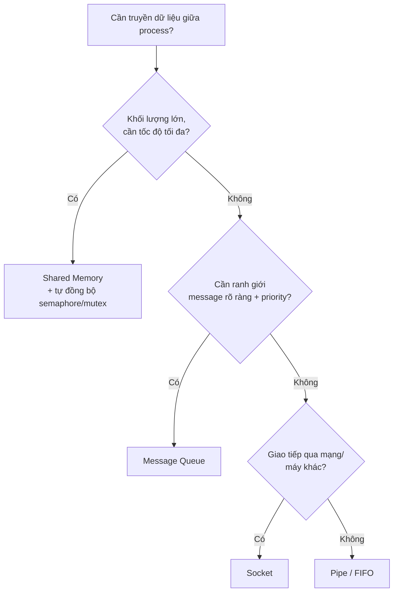
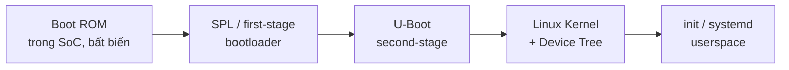

# 📘 FILE 1 — LÝ THUYẾT CỐT LÕI
### Phỏng vấn: **BSP Engineer** & **C++ Engineer** · Mid-level (~3 năm) · Embedded / Linux

> **Cách đọc:** Mỗi mục có *Bản chất* (hiểu gốc) → *Sơ đồ/Code* (hình dung được) → *Điểm phỏng vấn* (chốt ý interviewer muốn nghe). Ký hiệu 🔥 = gần như chắc chắn bị hỏi với JD của bạn.

---

## MỤC LỤC
- **A. Modern C++** — RAII, smart pointer, move, perfect forwarding, C++17, vtable
- **B. System Programming** — IPC, message queue, thread, deadlock, process
- **C. Embedded Linux** — HAL, driver, Device Tree
- **D. Boot & Secure Boot** *(BSP)* — boot chain, A/B partition, signed image
- **E. Bus Protocols** — I2C, SPI, UART
- **F. Kernel/User space & Debugging** — GDB, core dump, dmesg, cross-layer
- **G. Data Structures & Algorithms** — gồm circular buffer, bit manipulation

---

# A. MODERN C++

## A.1. RAII — nền tảng tư duy C++ 🔥

**Bản chất:** *Resource Acquisition Is Initialization*. Gắn vòng đời tài nguyên (memory, file, mutex, fd, socket) vào vòng đời object: **acquire trong constructor, release trong destructor**. Khi object ra khỏi scope (kể cả do exception), destructor tự chạy → không bao giờ leak.

```cpp
// Không RAII — dễ leak nếu return sớm hoặc throw
void bad() {
    FILE* f = fopen("a.txt", "r");
    if (something_failed()) return;   // ❌ quên fclose -> leak
    fclose(f);
}

// RAII — tài nguyên tự dọn
class FileGuard {
    FILE* f_;
public:
    explicit FileGuard(const char* p) : f_(fopen(p, "r")) {}
    ~FileGuard() { if (f_) fclose(f_); }     // luôn chạy khi ra scope
    FILE* get() const { return f_; }
};
void good() {
    FileGuard f("a.txt");
    if (something_failed()) return;   // ✅ destructor vẫn fclose
}
```

**Điểm phỏng vấn:** RAII là cách C++ đạt *exception safety*. Khi exception ném ra, **stack unwinding** gọi destructor của mọi object đã khởi tạo trên stack → tài nguyên được nhả tự động. `lock_guard`, `unique_ptr`, `ifstream` đều là RAII.

---

## A.2. Smart Pointers 🔥

### Tổng quan
| Loại | Sở hữu | Copy được? | Overhead | Dùng khi |
|------|--------|-----------|----------|----------|
| `unique_ptr` | Độc quyền | Không (chỉ move) | ~0 | Mặc định cho owning pointer |
| `shared_ptr` | Chia sẻ | Có | Control block + atomic | Nhiều chủ sở hữu thật sự |
| `weak_ptr` | Không sở hữu | Có | Nhẹ | Phá vòng tham chiếu, observer |

### shared_ptr hoạt động bên trong

```
   shared_ptr A ─┐                      ┌─ shared_ptr B
                 │                      │
                 ▼                      ▼
        ┌──────────────── CONTROL BLOCK ────────────────┐
        │  strong_count = 2   (số shared_ptr)           │
        │  weak_count   = 0   (số weak_ptr)             │
        └───────────────────────┬───────────────────────┘
                                 │ trỏ tới
                                 ▼
                        ┌─────────────────┐
                        │   Object (T)    │
                        └─────────────────┘

Object bị huỷ khi strong_count == 0
Control block bị huỷ khi strong_count == 0 VÀ weak_count == 0
```

```cpp
auto p = std::make_shared<int>(42);   // 1 lần cấp phát cho cả object + control block
std::shared_ptr<int> q = p;           // strong_count: 1 -> 2
q.reset();                            // strong_count: 2 -> 1
// p ra scope -> strong_count -> 0 -> object huỷ
```

**🔥 Câu bẫy kinh điển — shared_ptr có thread-safe không?**
> Bộ đếm tham chiếu là **atomic**, nên copy/destroy shared_ptr từ nhiều thread là an toàn. NHƯNG **object được trỏ tới KHÔNG được bảo vệ** — nhiều thread cùng ghi vào object đó vẫn cần mutex. Tóm lại: *"control block thread-safe, payload thì không"*.

### Circular reference (vòng tham chiếu) — vì sao leak & cách phá

```
   ┌─────────┐   shared_ptr   ┌─────────┐
   │ Node A  │ ─────────────► │ Node B  │
   │         │ ◄───────────── │         │
   └─────────┘   shared_ptr   └─────────┘
        strong_count của cả hai không bao giờ về 0  ➜  LEAK
```

```cpp
struct Node {
    std::shared_ptr<Node> next;   // ❌ nếu hai chiều đều shared_ptr -> leak
};
// FIX: một chiều dùng weak_ptr
struct NodeFixed {
    std::shared_ptr<NodeFixed> next;   // chiều "sở hữu"
    std::weak_ptr<NodeFixed>   prev;   // chiều "tham chiếu ngược" -> phá vòng
};
```

`weak_ptr` không tăng strong_count; muốn dùng phải `.lock()` để lấy `shared_ptr` tạm (trả về rỗng nếu object đã chết).

**Điểm phỏng vấn:** `make_shared` cấp 1 block cho cả object + control block → nhanh hơn, ít fragmentation; nhược điểm: memory của object chỉ thực sự trả lại khi cả weak_count = 0.

---

## A.3. Move Semantics 🔥

**Bản chất:** *lvalue* có tên/địa chỉ, sống lâu; *rvalue* là tạm thời sắp huỷ. **Move** "đánh cắp" ruột của object nguồn (chuyển con trỏ nội bộ) thay vì copy sâu, để lại nguồn ở trạng thái *hợp lệ nhưng rỗng*.

```cpp
class Buffer {
    int* data_; size_t size_;
public:
    // Move constructor: cướp tài nguyên, KHÔNG cấp phát mới
    Buffer(Buffer&& other) noexcept
        : data_(other.data_), size_(other.size_) {
        other.data_ = nullptr;   // để nguồn rỗng, an toàn khi huỷ
        other.size_ = 0;
    }
};

Buffer a = make_buffer();
Buffer b = std::move(a);   // a giờ rỗng; không deep-copy
```

**`std::move` thực ra KHÔNG di chuyển gì** — nó chỉ là `static_cast` sang rvalue reference để overload move được chọn. Việc "di chuyển" thật nằm trong move constructor.

### Rule of 0 / 3 / 5
- **Rule of 3:** nếu cần tự định nghĩa 1 trong {destructor, copy ctor, copy assign} thì thường cần cả 3.
- **Rule of 5:** thêm move ctor + move assign cho C++ hiện đại.
- **Rule of 0 (ưu tiên):** đừng tự quản lý tài nguyên thô — dùng smart pointer/STL container, để compiler tự sinh đúng cả 5.

`noexcept` trên move quan trọng: STL container (vd `vector` khi realloc) chỉ chọn move thay vì copy nếu move được đánh dấu `noexcept`.

---

## A.4. Perfect Forwarding & Universal Reference 🔥 (bạn yêu cầu bổ sung)

**Vấn đề cần giải:** Viết hàm wrapper truyền tham số xuống hàm khác mà **giữ nguyên tính lvalue/rvalue** của nó (để không mất cơ hội move). Nếu không, mọi thứ truyền qua wrapper đều thành lvalue → mất move.

**Hai mảnh ghép:**
1. **Universal (forwarding) reference `T&&`** — khi `T` được *suy luận* (template), `T&&` không phải rvalue ref mà là "universal ref": nhận được cả lvalue lẫn rvalue (reference collapsing).
2. **`std::forward<T>`** — cast có điều kiện: giữ nguyên lvalue thành lvalue, rvalue thành rvalue.

```cpp
// Factory truyền args xuống constructor mà giữ nguyên value category
template <typename T, typename... Args>
std::unique_ptr<T> my_make_unique(Args&&... args) {
    return std::unique_ptr<T>(new T(std::forward<Args>(args)...));
    //                                    ^ perfect forwarding
}

std::string s = "hi";
my_make_unique<Widget>(s);              // s là lvalue -> copy vào ctor
my_make_unique<Widget>(std::string{}); // rvalue -> move vào ctor (giữ được!)
```

**Phân biệt then chốt (hay bị hỏi):**
- `void f(Widget&& w)` → **rvalue reference thật** (kiểu cụ thể, không suy luận).
- `template<class T> void f(T&& w)` → **universal reference** (T được suy luận).
- Dùng `std::move` cho rvalue ref thật; dùng `std::forward` cho universal ref.

**Reference collapsing (lý do nó hoạt động):** `& &`→`&`, `& &&`→`&`, `&& &`→`&`, `&& &&`→`&&`. Chỉ "rvalue && rvalue" mới ra rvalue.

---

## A.5. Kỹ thuật C++17 hay hỏi 🔥 (bạn yêu cầu bổ sung)

**`std::optional<T>`** — biểu diễn "có thể không có giá trị", thay cho sentinel (-1, nullptr) hay output param.
```cpp
std::optional<int> parse(const std::string& s);
if (auto v = parse("42")) use(*v);   // có giá trị
```

**`std::variant<A,B,...>`** — union an toàn kiểu (type-safe), biết đang giữ kiểu nào. Truy cập qua `std::get` / `std::visit`.
```cpp
std::variant<int, std::string> v = "hello";
std::visit([](auto&& x){ /* xử lý */ }, v);
```

**`std::string_view`** — "cửa sổ" chỉ-đọc (con trỏ + độ dài) lên chuỗi có sẵn, **không copy, không sở hữu**. Cực hợp embedded vì tránh cấp phát.
> ⚠️ Bẫy: string_view không giữ chuỗi sống — đừng để nó trỏ tới temporary đã huỷ (dangling).

**Structured bindings** — tách tuple/struct ra biến.
```cpp
auto [it, inserted] = mymap.insert({k, v});
for (const auto& [key, val] : mymap) { /* ... */ }
```

**`if constexpr`** — rẽ nhánh tại compile-time trong template (loại bỏ nhánh không hợp lệ).
```cpp
template<class T> auto serialize(T x) {
    if constexpr (std::is_integral_v<T>) return to_bytes(x);
    else return x.serialize();
}
```

**Khác đáng nhớ:** `[[nodiscard]]` (cảnh báo nếu bỏ giá trị trả về), `std::filesystem`, inline variables, fold expressions (`(args + ...)`).

---

## A.6. Virtual Function / vtable 🔥 (bạn dùng OOP cho multi-chipset → bị đào sâu)

**Bản chất:** Mỗi class có virtual function → compiler sinh một **vtable** (mảng con trỏ hàm). Mỗi object chứa **vptr** trỏ tới vtable của class thực. Gọi virtual = tra vtable lúc runtime → gọi đúng override (**dynamic dispatch**).

```
  Base* p = new DerivedB();    // chipset B
        │
        ▼  object có vptr
   ┌──────────┐        ┌──────── vtable của DerivedB ───────┐
   │  vptr  ──┼──────► │ [0] DerivedB::setBrightness()       │
   │  data... │        │ [1] DerivedB::readSensor()          │
   └──────────┘        └─────────────────────────────────────┘

   p->setBrightness();  // tra vtable[0] -> chạy đúng bản của chipset B
```

```cpp
struct IDisplayHal {                 // interface chung cho mọi chipset
    virtual void setBrightness(int) = 0;   // pure virtual -> abstract
    virtual ~IDisplayHal() = default;      // 🔥 virtual destructor BẮT BUỘC
};
struct ChipsetA : IDisplayHal { void setBrightness(int v) override {/*...*/} };
struct ChipsetB : IDisplayHal { void setBrightness(int v) override {/*...*/} };

IDisplayHal* hal = make_for_current_chipset();  // tầng trên không biết là chip nào
hal->setBrightness(80);                         // dispatch đúng implementation
```

**🔥 Vì sao base class cần virtual destructor?**
> Nếu `delete` một object dẫn xuất qua con trỏ base mà base destructor **không** virtual → chỉ destructor của base chạy, phần dẫn xuất không được dọn → **undefined behavior / leak**. Quy tắc: class dùng làm base đa hình PHẢI có virtual destructor.

**Chi phí:** mỗi object to thêm 1 con trỏ (vptr); mỗi gọi virtual là 1 lần truy cập gián tiếp, **không inline được**. Trong hot path embedded cần cân nhắc.

---

## A.7. const / static / volatile / các keyword

- **`const` correctness:** `const` method cam kết không sửa state; tham số `const&` tránh copy mà vẫn an toàn. Giúp compiler bắt lỗi + tối ưu.
- **`static`:** trong hàm → giữ giá trị qua các lần gọi, khởi tạo 1 lần (thread-safe từ C++11). File scope → internal linkage. Class member → chia sẻ chung mọi instance.
- **`volatile` (🔥 embedded):** cấm compiler cache/tối ưu việc đọc-ghi biến → bắt buộc khi đọc **thanh ghi phần cứng (MMIO)** hoặc biến bị **ISR** sửa. ⚠️ `volatile` KHÔNG đảm bảo atomicity/thread-safety — đó là việc của `std::atomic`/mutex.
- **`explicit`:** chặn implicit conversion ngoài ý muốn của constructor 1 tham số.
- **`constexpr`:** tính tại compile-time, hợp để thay magic number / tính bảng tra cứu.

---

# B. SYSTEM PROGRAMMING

## B.1. Các cơ chế IPC — so sánh & khi nào dùng



| Cơ chế | Tốc độ | Ranh giới msg | Đồng bộ | Ghi chú |
|--------|--------|---------------|---------|---------|
| Pipe/FIFO | TB | Không (byte stream) | Kernel lo | Đơn giản, 1 chiều |
| Message Queue | TB | **Có** | Kernel lo | Có priority, async, decouple |
| Shared Memory | **Nhanh nhất** | — | **Tự lo** | Không copy qua kernel |
| Socket | Chậm hơn | Tùy loại | Kernel lo | Liên máy / mạng |
| Signal | — | — | — | Báo sự kiện, mang ít data |

## B.2. 🔥 POSIX Message Queue cho S-Box (câu chuyện CỐT LÕI của bạn)

**Bối cảnh:** Nhiều S-Box ghép thành một màn hình lớn, độ sáng phải đồng bộ và **chuyển mượt theo hiệu ứng sáng dần/tối dần (fade ramp)** dựa trên cảm biến ánh sáng môi trường.

**Vì sao message queue hợp ở đây:**
- Brightness được đẩy vào queue như một **chuỗi giá trị theo thời gian** → consumer lấy ra lần lượt tạo nên hiệu ứng ramp mượt.
- **Ranh giới message rõ ràng:** mỗi bước brightness là một message trọn vẹn, không phải tự cắt luồng byte như pipe.
- **Decouple** producer (logic cảm biến) và consumer (driver điều khiển đèn nền), không cần chạy đồng bộ khít nhau.
- Có **priority** nếu cần lệnh khẩn (vd tắt khẩn cấp) chen lên trước.

### 🔥 Xử lý khi message queue ĐẦY (câu hỏi bạn nêu)

Mặc định `mq_send` sẽ **block** tới khi có chỗ; nếu mở với `O_NONBLOCK` thì trả lỗi `EAGAIN`. Cả hai đều **chưa lý tưởng** cho luồng brightness. Giải pháp đúng bản chất:

> **Ý tưởng cốt lõi: với fade ramp, chỉ giá trị ĐÍCH mới nhất là quan trọng — các giá trị trung gian cũ có thể bỏ.** Vì vậy không nên để producer block hay làm rớt giá trị mới nhất.

Các chiến lược (nói được 2-3 cái là ăn điểm):
1. **Latest-value-wins / coalescing:** thay vì hàng đợi dài, giữ một "ô giá trị đích" mới nhất; consumer luôn tiến *về phía* giá trị đích đó và tự nội suy ramp. Producer ghi đè đích, không bao giờ tràn.
2. **Drop-oldest (overwrite ring):** queue dung lượng nhỏ; khi đầy, bỏ phần tử cũ nhất để nhận giá trị mới (giá trị mới phản ánh môi trường hiện tại chính xác hơn). POSIX mq không tự làm điều này nên thường tự cài bằng shared memory + ring buffer.
3. **Rate limiting / throttling ở producer:** giới hạn tần suất đẩy (vd 60 lần/giây), khớp tốc độ consumer xử lý → queue không bao giờ dồn.
4. **Non-block + đo backpressure:** nếu `EAGAIN` lặp lại nhiều → tín hiệu consumer chậm → giảm tần suất producer hoặc gộp giá trị.

**Chốt ý phỏng vấn:** *"Vì brightness là tín hiệu hội tụ về một đích, tôi ưu tiên coalescing/latest-wins thay vì để queue đầy rồi block — block sẽ làm trễ phản ứng với ánh sáng môi trường, còn drop giá trị mới thì sai hướng. Giữ giá trị đích mới nhất + consumer nội suy ramp là đúng bản chất bài toán."*

## B.3. Thread, Mutex, Condition Variable, Deadlock 🔥

**Race condition:** ≥2 thread truy cập chung 1 dữ liệu, ít nhất 1 ghi, không đồng bộ → kết quả phụ thuộc thứ tự chạy (non-deterministic).

**Deadlock — 4 điều kiện Coffman (PHẢI thuộc):**
```
1. Mutual exclusion   - tài nguyên không chia sẻ được
2. Hold and wait      - giữ cái này, chờ cái kia
3. No preemption      - không cướp lại được
4. Circular wait      - T1 chờ T2, T2 chờ T1 (vòng)
   ➜ Đủ cả 4 mới deadlock. Phá 1 cái là hết.
```
**Cách phá phổ biến nhất:** **lock ordering** — mọi thread luôn khoá nhiều mutex theo *cùng một thứ tự cố định* → phá "circular wait". Hoặc `try_lock` + timeout, hoặc `std::scoped_lock` (khoá nhiều mutex một lần, tránh deadlock).

```cpp
std::mutex m;
std::condition_variable cv;
bool ready = false;

// Consumer
std::unique_lock<std::mutex> lk(m);
cv.wait(lk, []{ return ready; });   // 🔥 predicate trong while ngầm -> chống spurious wakeup

// Producer
{ std::lock_guard<std::mutex> lk(m); ready = true; }
cv.notify_one();
```
**🔥 Vì sao `cv.wait` phải có predicate (hoặc `while`, không phải `if`)?** Vì có **spurious wakeup** (thread bị đánh thức mà điều kiện chưa đúng) và race; predicate kiểm tra lại sau mỗi lần thức.

## B.4. Process: fork / exec / zombie

- `fork()` → tạo con (copy-on-write không gian địa chỉ). Trả **0 cho con**, **PID con cho cha**.
- `exec()` → thay image hiện tại bằng chương trình mới (không tạo process mới).
- **Zombie:** con chết, cha chưa `wait()` → entry còn trong process table. Dọn bằng `wait()/waitpid()`.
- **Orphan:** cha chết trước → con được `init` (PID 1) nhận nuôi và reap.

---

# C. EMBEDDED LINUX (HAL · Driver · Device Tree)

## C.1. HAL — Hardware Abstraction Layer 🔥 (bạn làm trực tiếp)

**Bản chất:** Lớp trung gian che giấu chi tiết phần cứng, cung cấp interface ổn định cho tầng trên. Đổi chipset → chỉ thay implementation HAL, tầng ứng dụng không đổi.

```
   ┌─────────────────────────────┐
   │      Application Logic       │  (không biết chip nào)
   └──────────────┬──────────────┘
                  │ gọi qua interface chung
   ┌──────────────▼──────────────┐
   │     HAL Interface (abstract) │  setBrightness(), readSensor()...
   └───┬───────────┬───────────┬──┘
       │           │           │   (OOP: mỗi chipset 1 implementation)
   ┌───▼───┐   ┌───▼───┐   ┌───▼───┐
   │Chip A │   │Chip B │   │Chip C │
   └───┬───┘   └───┬───┘   └───┬───┘
       └───── phần cứng SoC ───┘
```

**Câu trả lời mẫu:**
> "HAL trừu tượng hoá phần cứng để tầng ứng dụng độc lập với chipset. Tôi định nghĩa interface HAL chung, mỗi SoC là một lớp dẫn xuất override (base interface + derived theo chipset). Hỗ trợ chip mới chỉ cần viết lớp dẫn xuất mới, không sửa logic tầng trên — giảm mạnh chi phí porting."

## C.2. Device Driver cơ bản (BSP cần nắm)

- **Character device:** truy cập theo byte/stream (UART, sensor, đa số driver bạn gặp). **Block device:** theo khối (ổ đĩa, eMMC).
- **`struct file_operations`:** bảng con trỏ hàm `open / read / write / unlocked_ioctl / release` — driver "đăng ký" hành vi của mình với kernel.
- **`ioctl`:** kênh gửi lệnh điều khiển đặc thù không hợp với read/write (vd set chế độ dimming, query trạng thái).
- **`copy_to_user` / `copy_from_user`:** chuyển dữ liệu an toàn giữa user↔kernel; **không** được deref thẳng con trỏ user-space trong kernel.
- **Probe/bind:** với DT, driver có bảng `compatible`; kernel match node DT → gọi `probe()` của driver.

```c
static const struct of_device_id my_dt_ids[] = {
    { .compatible = "samsung,my-dimming-v2" },
    { /* sentinel */ }
};
static struct platform_driver my_drv = {
    .probe  = my_probe,
    .driver = { .name = "my_dimming", .of_match_table = my_dt_ids },
};
```

## C.3. Device Tree 🔥 (bạn làm DT update → bị hỏi chắc)

**Bản chất:** File mô tả phần cứng (`.dts` → biên dịch ra `.dtb`) cho kernel đọc lúc boot, thay vì hard-code thông tin board trong source kernel. Gồm **node** (thiết bị) và **property** (địa chỉ base, IRQ, clock, GPIO...).

```dts
dimming@12340000 {
    compatible = "samsung,my-dimming-v2";  // khớp với driver
    reg = <0x12340000 0x1000>;             // địa chỉ base + kích thước vùng thanh ghi
    interrupts = <0 42 4>;                  // số hiệu IRQ
    clocks = <&clk_ctrl 7>;                 // nguồn clock
    status = "okay";
};
```

**Câu trả lời mẫu:**
> "Device Tree tách mô tả phần cứng ra khỏi code kernel. Cùng một kernel image chạy được nhiều board chỉ bằng cách nạp `.dtb` khác nhau. Khi port sản phẩm mới, tôi cập nhật node cho phần cứng mới — base address, interrupt, clock — và driver bind qua `compatible` string."

**Follow-up hay gặp:** *`compatible` để làm gì?* → khớp node DT với đúng driver. *Vì sao không hard-code?* → một image, nhiều board; tách dữ liệu khỏi code; dễ bảo trì.

## C.4. Cross compilation & Build

- **Cross compile:** build trên **host** (x86) ra binary chạy trên **target** (ARM) bằng toolchain riêng (`aarch64-linux-gnu-gcc`). Khái niệm: *host* (máy build) vs *target* (máy chạy) vs *sysroot* (thư viện/header của target).
- **Makefile vs CMake:** Makefile mô tả trực tiếp luật build; **CMake là generator** sinh ra Makefile/Ninja, quản lý cross-platform dễ hơn (dùng *toolchain file* để chỉ định compiler target).
- **Kernel migration (5.10 → 6.12):** API kernel thay đổi/deprecate giữa các phiên bản → driver phải sửa khớp (chữ ký hàm đổi, header dời chỗ, cơ chế cũ bị gỡ). Quy trình: đọc changelog → build bắt lỗi → sửa từng API → test trên target → kiểm tra `dmesg` sạch warning.

---

# D. BOOT & SECURE BOOT (BSP) 🔥

> **Cần sâu tới đâu (cho mid-level BSP):** Bạn cần **hiểu khái niệm và giải thích thông minh** — luồng boot, vì sao cần secure boot, A/B partition để làm gì, signed image nghĩa là gì. **KHÔNG** cần implement crypto, không cần thuộc lòng nội bộ U-Boot verified boot hay tự viết bootloader. Mục tiêu: nói chuyện được với người làm sâu, biết mình đang ở đâu trong bức tranh. Phần dưới đủ cho mức đó.

## D.1. Luồng boot Embedded Linux (chain of trust ngầm)



**Từng tầng:**
- **Boot ROM:** code nhúng cứng trong SoC (không sửa được), chạy đầu tiên, nạp bootloader kế tiếp. Là **gốc tin cậy (root of trust)**.
- **SPL (Secondary Program Loader):** nhỏ gọn, khởi tạo DRAM, nạp U-Boot.
- **U-Boot:** khởi tạo phần cứng cơ bản, đọc kernel + DTB từ storage, truyền tham số (bootargs) rồi nhảy vào kernel.
- **Kernel:** unpack, mount rootfs, chạy init.
- **init/systemd:** khởi động dịch vụ userspace.

## D.2. Secure Boot & Chain of Trust 🔥

**Bản chất:** Mỗi tầng **xác minh chữ ký** của tầng kế tiếp trước khi trao quyền chạy. Bắt đầu từ Boot ROM (tin cậy tuyệt đối vì nằm trong silicon) → chỉ chạy bootloader có chữ ký hợp lệ → bootloader chỉ chạy kernel có chữ ký hợp lệ → ... Một mắt xích sai chữ ký = dừng boot. Mục tiêu: **chống chạy firmware giả mạo/đã bị sửa**.

```
Boot ROM (root of trust)
   │ verify chữ ký
   ▼
Bootloader (signed) ──verify──► Kernel (signed) ──verify──► rootfs (signed)
   ✗ sai chữ ký ở bất kỳ đâu  ➜  DỪNG BOOT
```

- **Public/Private key:** nhà sản xuất ký image bằng **private key** (giữ bí mật); thiết bị xác minh bằng **public key** đã nung sẵn (thường trong **eFuse/OTP** — bộ nhớ một-lần-ghi trong SoC).
- **Signed package (🔥 đúng như Samsung bạn nêu):** mọi package build ra phải được **ký** thì thiết bị mới chấp nhận. Image không ký / sai chữ ký bị từ chối → ngăn cài firmware trái phép.

## D.3. A/B Partition — Rollback an toàn 🔥 (Samsung dùng, bạn nêu)

**Bản chất:** Có **hai bộ partition hệ thống A và B**. Một bộ đang chạy, bộ kia để cập nhật. Update ghi vào slot rảnh; nếu boot mới **thất bại** → tự **rollback** về slot cũ đang tốt → thiết bị không bao giờ "chết" sau update lỗi (chống bricking).

```
        ┌──────────── Slot A (đang chạy, tốt) ────────────┐
        │  bootloader_a | kernel_a | rootfs_a             │
        └──────────────────────────────────────────────────┘
        ┌──────────── Slot B (nhận update mới) ───────────┐
        │  bootloader_b | kernel_b | rootfs_b             │
        └──────────────────────────────────────────────────┘

  Update -> ghi vào B -> đánh dấu B "thử nghiệm" -> reboot vào B
     │
     ├─ B boot OK  -> đánh dấu B "tốt", lần sau chạy B
     └─ B boot FAIL (hết số lần thử) -> rollback về A (vẫn nguyên vẹn)
```

- **Bộ đếm thử (boot count) + cờ "successful":** bootloader thử slot mới vài lần; không thành công thì quay về slot cũ.
- **Lợi ích:** update OTA an toàn, không downtime, không brick. **Đánh đổi:** tốn gấp đôi dung lượng cho 2 slot.

**Câu trả lời mẫu (gói gọn 30 giây):**
> "Thiết bị có hai slot A/B. Update ghi vào slot không hoạt động rồi reboot sang đó; bootloader theo dõi boot có thành công không, nếu fail thì rollback về slot cũ vẫn nguyên vẹn — nên update lỗi không làm hỏng thiết bị. Kết hợp secure boot, mọi image trong slot đều phải có chữ ký hợp lệ mới được chạy."

**Nếu interviewer hỏi sâu hơn mức bạn biết:** cứ thành thật — *"Tôi hiểu ở mức khái niệm và vận hành; phần triển khai crypto/fuse cụ thể tôi chưa làm trực tiếp nhưng sẵn sàng học."* Trung thực + biết ranh giới kiến thức được đánh giá cao hơn là chém.

---

# E. BUS PROTOCOLS — I2C · SPI · UART 🔥 (mức trung bình: hiểu & chọn đúng)

## E.1. Bảng so sánh nhanh (thuộc bảng này là đủ phần lớn câu hỏi)

| | **UART** | **I2C** | **SPI** |
|---|---|---|---|
| Số dây | 2 (TX, RX) | 2 (SDA, SCL) | 4 (MOSI, MISO, SCLK, CS) |
| Đồng bộ? | **Bất đồng bộ** (không clock) | Đồng bộ (có clock) | Đồng bộ (có clock) |
| Kiểu | Point-to-point | **Bus đa thiết bị** (địa chỉ) | Master + nhiều slave (chọn bằng CS) |
| Tốc độ | Thấp (~115200 bps phổ biến) | TB (100k/400k/1M+ Hz) | **Cao nhất** (chục MHz) |
| Song công | Full-duplex | Half-duplex | Full-duplex |
| Chọn thiết bị | — | Theo **địa chỉ** trên bus | Theo chân **CS** riêng |
| Dùng điển hình | Console/log, GPS, modem | Sensor, EEPROM, RTC, PMIC | Flash, màn hình, ADC tốc độ cao |

## E.2. UART
**Bản chất:** Truyền nối tiếp **bất đồng bộ** — không có dây clock, hai bên phải thoả thuận **baud rate** trước. Khung: start bit → data bits → (parity) → stop bit. Hai dây TX/RX chéo nhau.
**Khi nào dùng:** debug console/log (rất hay trên embedded), giao tiếp đơn giản point-to-point, GPS/modem.
**Điểm phỏng vấn:** sai baud rate → nhận ra ký tự rác. UART điểm-điểm, không có địa chỉ nên không mở rộng nhiều thiết bị trên cùng dây.

## E.3. I2C
**Bản chất:** Bus **2 dây dùng chung** (SDA data, SCL clock), **đa thiết bị**: mỗi slave có **địa chỉ 7-bit**. Master phát clock, gọi địa chỉ, đọc/ghi. Dây cần **điện trở pull-up** (open-drain).
```
   Master ──┬── SDA ──┬─────────┬─────────┐
            │         │         │         │
            └── SCL ──┼─────────┼─────────┤
                   Slave 0x50  0x68     0x1A   (mỗi slave 1 địa chỉ)
```
**Khi nào dùng:** nối nhiều sensor/IC tốc độ thấp với ít dây (EEPROM, RTC, cảm biến nhiệt, **cảm biến ánh sáng** kiểu bạn dùng ở S-Box, PMIC).
**Điểm phỏng vấn:** ưu điểm = ít dây, nhiều thiết bị; nhược = chậm hơn SPI, có overhead địa chỉ/ACK, đụng địa chỉ nếu hai IC trùng. Khái niệm hay hỏi: **start/stop condition, ACK/NACK, clock stretching, địa chỉ 7-bit**.

## E.4. SPI
**Bản chất:** Đồng bộ, **4 dây**, full-duplex, **nhanh nhất**. Master chọn slave bằng chân **CS (Chip Select)** riêng cho từng slave; dữ liệu đi MOSI (master→slave) và MISO (slave→master) cùng lúc theo SCLK.
```
   Master ── SCLK ──────┬──────────┬─────
          ── MOSI ──────┼──────────┼─────
          ── MISO ──────┼──────────┼─────
          ── CS0 ───────┘          │
          ── CS1 ──────────────────┘
                     Slave0      Slave1   (mỗi slave 1 dây CS)
```
**Khi nào dùng:** cần băng thông cao — flash NOR/NAND, màn hình LCD, ADC nhanh, SD card.
**Điểm phỏng vấn:** nhanh + full-duplex, nhưng tốn dây (mỗi slave thêm 1 CS), không có cơ chế ACK chuẩn. Khái niệm: **CPOL/CPHA (SPI mode 0–3)** = cấu hình cực tính & pha clock; master và slave phải cùng mode.

## E.5. Chọn protocol thế nào? (câu tổng hợp hay hỏi)
> "**UART** khi cần kênh nối tiếp đơn giản điểm-điểm như console/log. **I2C** khi cần nối *nhiều* thiết bị tốc độ thấp với *ít dây* và chấp nhận tốc độ vừa phải (sensor, EEPROM, RTC). **SPI** khi cần *tốc độ cao*, full-duplex và chấp nhận tốn dây (flash, màn hình). Tóm lại đánh đổi giữa số dây, số thiết bị và tốc độ."

---

# F. KERNEL/USER SPACE & DEBUGGING

## F.1. Ranh giới Kernel ↔ User space 🔥

**Bản chất:** User space chạy privilege thấp, **không** truy cập thẳng phần cứng/bộ nhớ kernel. Muốn dùng dịch vụ kernel (I/O, cấp bộ nhớ, điều khiển thiết bị) phải qua **system call** — chuyển sang kernel mode có kiểm soát qua một "cổng" (trap). Cách ly này bảo vệ hệ thống khỏi crash/lỗi của ứng dụng.

```
   USER SPACE   |  printf -> write() ─┐
   ─────────────┼──────────────────── │ ── syscall (trap) ──┐
   KERNEL SPACE |                      ▼                     ▼
                |               sys_write()           driver -> phần cứng
```
**Follow-up:** *syscall hoạt động ra sao?* → instruction đặc biệt (vd `svc`/`syscall`) gây trap, CPU chuyển kernel mode, chạy handler, rồi trả về user mode với kết quả.

## F.2. GDB — dạy từ đầu 🔥 (bạn nói đây là điểm yếu — học kỹ phần này)

**Tư duy:** GDB cho phép **dừng chương trình tại điểm mong muốn, xem trạng thái, đi từng bước**. Không cần thuộc hết — nắm ~12 lệnh là đủ tự tin trong phỏng vấn.

### Build để debug
```bash
gcc -g -O0 prog.c -o prog   # -g: kèm symbol; -O0: tắt tối ưu để bước cho khớp dòng
```

### Bộ lệnh lõi (thuộc nhóm này là đủ)
| Lệnh | Viết tắt | Ý nghĩa |
|------|----------|---------|
| `break file:line` / `break func` | `b` | Đặt breakpoint |
| `run` | `r` | Chạy chương trình |
| `next` | `n` | Chạy dòng tiếp, **không** vào hàm |
| `step` | `s` | Chạy dòng tiếp, **có** vào hàm |
| `continue` | `c` | Chạy tiếp tới breakpoint sau |
| `finish` | — | Chạy hết hàm hiện tại rồi dừng |
| `print expr` | `p` | In giá trị biến/biểu thức |
| `backtrace` | `bt` | In **call stack** (cực quan trọng khi crash) |
| `frame N` | `f` | Nhảy tới khung stack thứ N |
| `info locals` | — | In mọi biến cục bộ |
| `watch var` | — | Dừng khi `var` **thay đổi giá trị** |
| `continue`/`quit` | `c`/`q` | Tiếp / thoát |

### Quy trình điển hình (crash do segfault)
```
gdb ./prog
(gdb) run                # chạy tới khi crash
(gdb) bt                 # xem nó chết ở hàm nào, chuỗi gọi ra sao
(gdb) frame 1            # vào khung gọi để xem context
(gdb) info locals        # xem biến -> tìm con trỏ null/ngoài biên
(gdb) print ptr          # kiểm tra giá trị nghi ngờ
```

### 🔥 Core dump (bạn nói team dùng server nội bộ phân tích — hiểu cơ chế)
**Core dump** = ảnh chụp bộ nhớ process tại lúc crash, lưu ra file. Phân tích *sau* (post-mortem), không cần bắt được lúc chạy.
```bash
ulimit -c unlimited            # cho phép sinh core
./prog                         # crash -> sinh file "core"
gdb ./prog core                # mở core
(gdb) bt                       # xem stack tại thời điểm chết
```
> Server nội bộ thường tự động thu core + symbol rồi chạy `bt`/phân tích. Bạn chỉ cần hiểu: **core = trạng thái đông cứng lúc chết → mở bằng gdb + binary có symbol → `bt` ra nguyên nhân**. Nắm được cơ chế này là đủ trả lời.

### 🔥 Remote debug cho embedded (target không có GDB đầy đủ)
```
   HOST (x86)                          TARGET (ARM)
   gdb-multiarch prog   <── mạng ──>   gdbserver :1234 ./prog
   (gdb) target remote <target-ip>:1234
```
**Bản chất:** chạy `gdbserver` nhẹ trên target, GDB đầy đủ chạy trên host kết nối qua TCP → debug binary trên thiết bị thật mà không cần cài cả GDB lên đó.

**Mẹo trả lời khi điểm yếu là GDB:** đừng giấu — nói thật bạn chủ yếu debug qua log + dmesg + core dump trên server, *và* bạn nắm được quy trình GDB lõi (`bt`, `break`, `watch`, remote). Thể hiện bạn biết công cụ phù hợp cho từng tình huống quan trọng hơn là thuộc lòng.

## F.3. dmesg & kernel debugging
- **`dmesg`:** xem **kernel ring buffer** — log driver, **kernel oops/panic**, lỗi OOM, cảnh báo. Lệnh hay dùng: `dmesg -w` (theo dõi realtime), `dmesg -l err`.
- **`printk`:** "printf của kernel", có mức log (`KERN_ERR`, `KERN_INFO`...). Cách debug driver cơ bản nhất.
- **Kernel oops vs panic:** *oops* = lỗi nghiêm trọng nhưng kernel cố sống tiếp; *panic* = không thể tiếp tục, dừng hệ thống. Cả hai in stack trace ra dmesg.
- **Công cụ khác:** `strace` (trace syscall của process), `ftrace`/`perf` (trace/đo hiệu năng kernel), `/proc` & `/sys` (xem trạng thái), `addr2line` (đổi địa chỉ → dòng code).

## F.4. 🔥 Cross-layer Debugging (ĐIỂM MẠNH của bạn — chuẩn bị 1 câu chuyện thật)

**Khung kể chuyện (giữ cấu trúc, thay nội dung thật của bạn):**
> *Triệu chứng → khoanh vùng từng tầng → công cụ mỗi tầng → nguyên nhân gốc → fix → verify.*
>
> "Brightness không cập nhật. **User-space:** xác nhận app gửi đúng giá trị (log/GDB). **Ranh giới:** kiểm tra lệnh ioctl có xuống tới driver không. **Kernel:** dùng `dmesg`/`printk` thấy driver nhận lệnh nhưng giá trị sai → nghi `copy_from_user` hoặc sai **offset thanh ghi**. **Gốc:** đọc lại register xác nhận offset sai. **Fix + verify:** sửa offset, chạy lại từ app xuống driver, brightness đúng. Bài học: lỗi cross-layer phải *lần theo dữ liệu qua từng tầng*, không đoán."

---

# G. DATA STRUCTURES & ALGORITHMS

> Bạn có chứng chỉ Samsung Advanced → kỳ vọng giải được **medium** + cài được các cấu trúc cơ bản từ đầu.

## G.1. Bảng độ phức tạp (thuộc lòng)
| Thao tác | Trung bình | Xấu nhất |
|----------|-----------|----------|
| Array index | O(1) | O(1) |
| Array/List search | O(n) | O(n) |
| Hash table get/put | O(1) | O(n) |
| BST search/insert | O(log n) | O(n) (lệch) |
| Heap push/pop | O(log n) | O(log n) |
| Binary search | O(log n) | O(log n) |
| Merge/Heap/Quick sort | O(n log n) | O(n²) (quick xấu nhất) |

## G.2. Patterns hay gặp
- **Two pointers:** mảng đã sort, tìm cặp tổng = target; đảo mảng.
- **Sliding window:** dãy con liên tiếp tối ưu (substring/subarray).
- **Hash map:** đếm tần suất, two-sum, tìm trùng.
- **BFS/DFS:** duyệt cây/đồ thị; BFS = shortest path đồ thị không trọng số.
- **DP cơ bản:** climbing stairs, Fibonacci, knapsack, LCS.
- **Stack:** ngoặc cân bằng, next-greater-element.

## G.3. 🔥 Circular Buffer / Ring Buffer (bạn chưa từng dùng — học kỹ)

**Vì sao quan trọng với embedded:** cấu trúc **producer–consumer** lý tưởng cho luồng dữ liệu liên tục — UART RX, audio/video stream, log, sự kiện. Dùng **mảng cố định** (không cấp phát động trong runtime), ghi đè vòng tròn → **bounded memory**, phù hợp hệ tài nguyên hạn chế.

**Bản chất:** một mảng kích thước cố định + 2 con trỏ **head** (ghi) và **tail** (đọc). Khi chạm cuối mảng thì vòng về đầu (modulo). Producer đẩy vào head, consumer lấy ra tail.

```
   capacity = 8
   index:   0   1   2   3   4   5   6   7
          [ . ][D1][D2][D3][ . ][ . ][ . ][ . ]
                 ▲             ▲
                tail          head
          (đọc tiếp ở đây)  (ghi tiếp ở đây)

   head chạm cuối -> quay về 0 (vòng tròn)
   full khi head sắp đè lên tail ; empty khi head == tail
```

**Cách phân biệt FULL vs EMPTY** (vì cả hai đều có thể là `head == tail`): kỹ thuật phổ biến là **bỏ trống 1 ô** — coi là full khi `(head + 1) % cap == tail`.

```cpp
template <typename T, size_t N>   // N = capacity (hi sinh 1 ô -> chứa N-1)
class RingBuffer {
    T buf_[N];
    size_t head_ = 0;   // vị trí ghi tiếp
    size_t tail_ = 0;   // vị trí đọc tiếp
public:
    bool empty() const { return head_ == tail_; }
    bool full()  const { return (head_ + 1) % N == tail_; }

    bool push(const T& v) {            // producer
        if (full()) return false;      // hoặc: ghi đè tail (drop-oldest)
        buf_[head_] = v;
        head_ = (head_ + 1) % N;
        return true;
    }
    bool pop(T& out) {                 // consumer
        if (empty()) return false;
        out = buf_[tail_];
        tail_ = (tail_ + 1) % N;
        return true;
    }
};
```

**Điểm phỏng vấn:**
- *Vì sao dùng ring buffer thay vì queue động?* → bounded memory, không malloc runtime, không fragmentation, O(1) push/pop, cache-friendly.
- *Khi đầy thì sao?* → hai chiến lược: **từ chối (backpressure)** hoặc **ghi đè cũ nhất (drop-oldest)** — chọn theo bài toán (log thường drop-oldest; lệnh quan trọng thì backpressure). *(Liên hệ chính câu trả lời message-queue-đầy của bạn ở mục B.2.)*
- *Single producer–single consumer (SPSC)* có thể làm **lock-free** bằng atomic index → rất nhanh, hay hỏi ở mức nâng cao.

## G.4. 🔥 Bit Manipulation (đặc thù embedded — hay hỏi)
```cpp
x |=  (1u << n);   // SET bit n
x &= ~(1u << n);   // CLEAR bit n
x ^=  (1u << n);   // TOGGLE bit n
bool b = (x >> n) & 1u;          // CHECK bit n
int cnt = __builtin_popcount(x); // đếm số bit 1 (hoặc Brian Kernighan: x &= x-1)
```
**Khái niệm hay hỏi:** **endianness** (little vs big — thứ tự byte; kiểm tra bằng cách ép con trỏ đọc byte thấp của số nhiều byte), bitmask cho cờ trạng thái/thanh ghi, vì sao dùng `unsigned` khi dịch bit.

## G.5. Một số implementation hay bị yêu cầu code tại chỗ
> (Lời giải chi tiết + code đầy đủ nằm ở **File 2 — Ngân hàng câu hỏi**, mục coding.)
- Đảo linked list (iterative + recursive)
- Phát hiện vòng trong linked list (Floyd fast/slow pointer)
- Reverse string / kiểm tra palindrome
- Two-sum bằng hash map
- Kiểm tra ngoặc cân bằng bằng stack
- BFS/DFS trên đồ thị
- Triển khai `memcpy` / `strlen` (rất hay hỏi cho C/embedded)
- FizzBuzz / đếm bit / swap không dùng biến tạm

---

## ✅ CHECKLIST TỰ KIỂM TRA (File 1)
- [ ] Giải thích trôi: RAII, vtable, virtual destructor, shared_ptr thread-safety, circular reference.
- [ ] Phân biệt được `std::move` vs `std::forward`, rvalue ref vs universal ref.
- [ ] Nói được 3 kỹ thuật C++17: optional, variant, string_view, structured bindings, if constexpr.
- [ ] 4 điều kiện deadlock + cách phá (lock ordering).
- [ ] Message queue đầy → coalescing/latest-wins (gắn S-Box).
- [ ] Boot chain + secure boot (chain of trust) + A/B partition rollback + signed image.
- [ ] Bảng so sánh UART/I2C/SPI + chọn cái nào khi nào.
- [ ] GDB: `bt`, `break`, `watch`, core dump workflow, gdbserver remote.
- [ ] Cài được ring buffer + 4 phép bit manipulation.