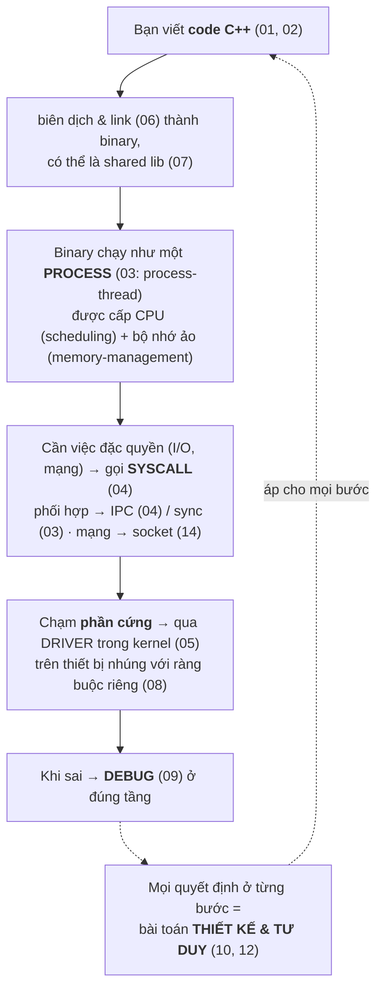

# OVERVIEW — Bản đồ tư duy toàn bộ tài liệu

> File này nối **15 topic** thành một bức tranh thống nhất. Đọc nó để thấy *vì sao* các topic được sắp xếp như vậy và chúng *liên kết* ra sao — thay vì học rời rạc. Đây là "hiểu kiến trúc cốt lõi" mà mục tiêu Senior hướng tới.

---

## 1. Một câu xâu chuỗi tất cả

> **Một chương trình C++ chạy trên Linux/embedded = code của bạn (C++) chạy như một process (OS) tương tác với hệ thống qua syscall (Linux) và phần cứng qua driver (Embedded), được đóng gói thành thư viện (Shared lib), build ra binary (Build), gỡ lỗi khi sai (Debug) — và mọi quyết định ở mỗi tầng đều là một bài toán tư duy & đánh đổi (Thinking).**

Mỗi topic là một **tầng** hoặc một **lát cắt** của câu chuyện đó.

---

## 2. Bản đồ phân tầng (cái gì nằm trên cái gì)

```mermaid
flowchart TD
    TD["🧠 <b>TƯ DUY</b> — cách NGHĨ & THIẾT KẾ (xuyên suốt mọi tầng)<br/>10 Thinking · 12 Design Patterns"]
    NN["💬 <b>NGÔN NGỮ</b> — công cụ biểu đạt<br/>01 C++ Fundamentals → 02 Modern C++ · 13 DSA"]
    DG["📦 <b>ĐÓNG GÓI</b> — source thành binary/lib<br/>06 Build Systems → 07 Shared Libraries"]
    HT["🖥️ <b>HỆ THỐNG</b> — nền tảng<br/>03 Operating System (lý thuyết) → 04 Linux (API thực tế) · 14 Networking"]
    PC["🔌 <b>PHẦN CỨNG</b> — chạm thiết bị<br/>05 Drivers & Device Tree · 08 Embedded Systems"]
    DBG["🐞 <b>09 Debugging</b> — soi mọi tầng khi sai · 11 Interview · 00 Glossary"]
    TD --> NN --> DG --> HT --> PC
    DBG -. "cắt ngang tất cả" .-> NN
    DBG -. .-> HT
    DBG -. .-> PC
```
*(Tầng dưới đỡ tầng trên; Tư duy và Debug không thuộc một tầng — chúng cắt ngang mọi tầng.)*

- **Tầng dưới đỡ tầng trên:** không hiểu memory model (01) thì không hiểu vtable, smart pointer (02), hay segfault (09). Không hiểu OS (03) thì không hiểu syscall (04) hay driver (05).
- **Tư duy & Debug cắt ngang:** không thuộc một tầng — áp dụng ở mọi tầng.

---

## 3. Bốn sợi chỉ đỏ xuyên suốt (cross-cutting threads)

Có vài **chủ đề lặp lại** ở nhiều topic — nhận ra chúng là dấu hiệu hiểu sâu:

### 🧵 (a) Quản lý tài nguyên & vòng đời
Ai sở hữu cái gì, sống bao lâu, ai dọn dẹp?
- Heap/stack ([01](01-cpp-fundamentals/memory-model.md)) → RAII/smart pointer ([02](02-modern-cpp/raii-smart-pointers.md)) → `devm_*` trong driver ([05](05-drivers-device-tree/driver-basics.md)) → ownership trong API ([07](07-shared-libraries/api-design.md)) → memory pool tránh fragmentation ([08](08-embedded-systems/constraints.md)).
- **Cùng một tư tưởng** (RAII) xuất hiện từ C++ tới kernel tới API design.

### 🧵 (b) Cô lập vs Chia sẻ
- Process cô lập (address space riêng) → cần **IPC** để giao tiếp ([03](03-operating-system/ipc.md), [04](04-linux-system-programming/ipc-linux.md), [14](14-networking/)).
- Thread chia sẻ bộ nhớ → cần **đồng bộ** (sync, atomic, mutex) ([03](03-operating-system/sync-primitives.md), [02](02-modern-cpp/concurrency.md)).
- Kernel/user cô lập → cần **syscall + copy_to/from_user** ([04](04-linux-system-programming/file-io.md), [05](05-drivers-device-tree/kernel-userspace.md)).
- **Một nguyên lý:** cô lập cho an toàn, nhưng phải trả giá bằng cơ chế giao tiếp/đồng bộ.

### 🧵 (c) Trừu tượng hoá & ranh giới ổn định
- Virtual memory giấu bộ nhớ vật lý ([03](03-operating-system/memory-management.md)); "everything is a file" giấu loại thiết bị ([04](04-linux-system-programming/file-io.md)); device tree tách phần cứng khỏi code ([05](05-drivers-device-tree/device-tree.md)); ABI/API là ranh giới ổn định ([07](07-shared-libraries/abi-versioning.md)); HAL/interface cho testability ([10](10-thinking/system-design.md), [12](12-design-patterns/solid-principles.md)).
- **Một nguyên lý:** giấu chi tiết sau một ranh giới ổn định → hai bên đổi độc lập (information hiding / DIP).

### 🧵 (d) Đánh đổi dưới ràng buộc
- Stack vs heap, template vs virtual, static vs shared lib, RTOS vs Linux, poll vs interrupt, time vs space... ([10](10-thinking/problem-solving.md)).
- **Một nguyên lý:** không có "tốt nhất", chỉ có phù hợp ràng buộc — luôn hỏi "tối ưu cho cái gì?".

---

## 4. Lộ trình nhân-quả điển hình (đọc theo dòng câu chuyện)



---

## 5. Cách dùng bản đồ này

- **Mới bắt đầu:** đọc file này trước để có khung, rồi đi theo [lộ trình trong README](README.md).
- **Khi học một topic:** đọc mục "🗺️ Bức tranh tổng thể" trong README của topic đó để thấy các file con ghép lại thế nào.
- **Khi ôn phỏng vấn:** các câu hỏi hay nhất là câu **nối nhiều topic** (vd "context switch tốn kém vì sao?" nối process + memory; "vì sao C++ ABI không ổn định?" nối C++ + shared lib). Luyện nhìn ra liên kết.
- **Khi bí một khái niệm:** tra [00-glossary.md](00-glossary.md) rồi theo link về topic gốc.

---
➡️ [README chính (mục lục + lộ trình)](README.md) · [CLAUDE.md (định hướng dự án)](CLAUDE.md)
